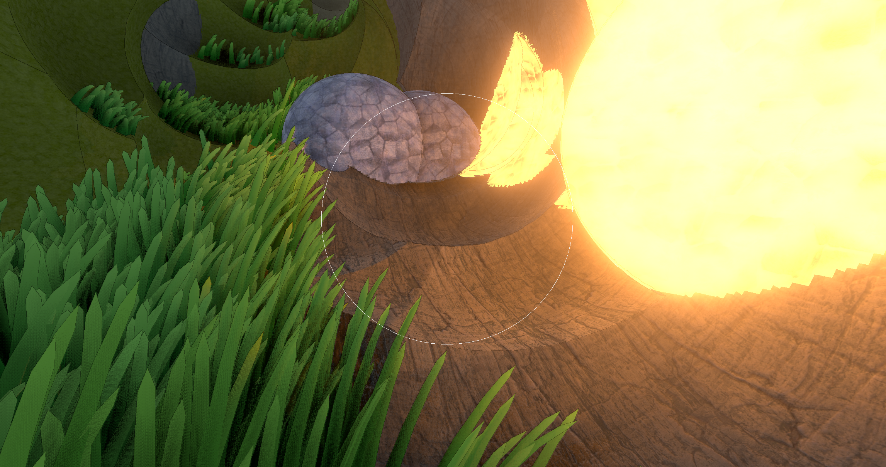
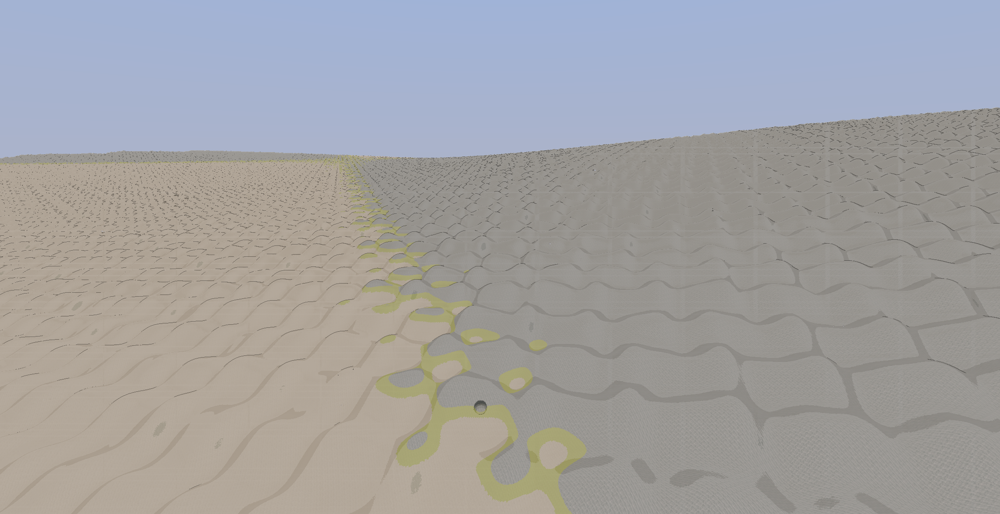
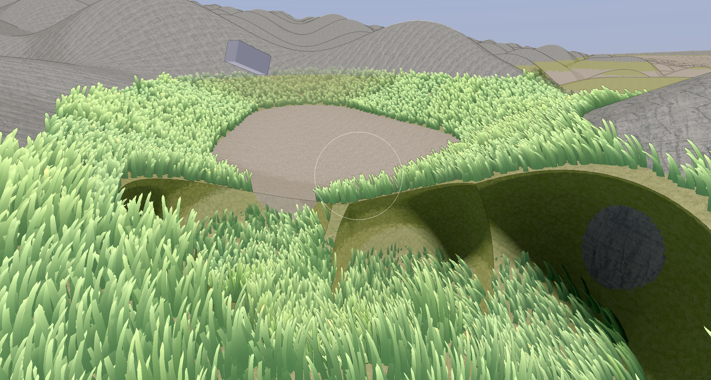

<p align="center">
  
</p>

# Voxel Everything

A destructible, smooth-SDF voxel terrain engine for **Godot 4**, written in **C++ as a GDExtension**.

Voxel Everything renders 5 cm voxels two ways at once — a compute **raymarched near field** through a sparse brick atlas, and a **surface-nets meshed far field** out to ~4 km — with GPU-evaluated CSG destruction, real physics for severed chunks, and an automated benchmark harness that reports per-pass p50/p99 against a 16 ms frame budget.

## Features

- **Dual-field rendering** — sphere-traced near field (compute, sparse 0.8 m brick atlas) + surface-nets far field out to ~4 km.
- **LoD & culling** — eight levels of surface-nets chunks selected by screen-space error, culled by frustum + HiZ, drawn in one indirect multi-draw.
- **Real destruction** — ordered CSG op lists re-evaluated on the GPU; regions that pass ~192 ops consolidate into override bricks instead of losing the player's edits.
- **Islands** — severed pieces become Jolt rigid bodies, land, sleep, and merge back into the terrain; collider builds split into octants so one fat chunk cannot stall the frame.
- **Benchmarked** — gdUnit harness logging per-pass p50/p99 vs. budget on RTX 4070 Laptop and Apple M1; full methodology in `docs/`.

## Screenshots

| | |
|---|---|
|  |  |

## Getting started

Clone with submodules (the engine links against `godot-cpp`):

```bash
git clone --recurse-submodules https://github.com/WMsans/voxel-everything
```

Build the GDExtension, then open the project in **Godot 4.x** and run the demo scene (`demo/main.tscn`):

```bash
./build.sh
```

Run the benchmark/test harness:

```bash
./gdunit_tests.sh
```

## Project layout

- `extension/` — the C++ GDExtension source (meshing, streaming, CSG, physics glue)
- `shaders/` — compute + render shaders (raymarch, surface nets, LoD, HiZ)
- `demo/` — playable demo scene, benchmark legs, debug tooling
- `docs/` — design notes and benchmark results (see `docs/PORTFOLIO.md` for measured numbers)

## Related

Part of [the author's graphics work](https://github.com/WMsans) — see also [RayTraceVoxel](https://github.com/WMsans/RayTraceVoxel) (Unity compute voxel engine) and [Unity_SDF_Terrain](https://github.com/WMsans/Unity_SDF_Terrain).
