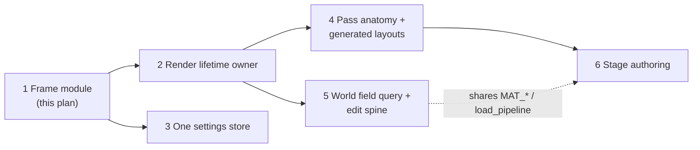

# Frame Module Implementation Plan

> **For agentic workers:** REQUIRED SUB-SKILL: Use superpowers:subagent-driven-development (recommended) or superpowers:executing-plans to implement this plan task-by-task. Steps use checkbox (`- [ ]`) syntax for tracking.

**Goal:** One module, `VoxelFrame`, owns the voxel frame; both compositors and the frame-rebuilding debug probes run it, so gdUnit tests exercise the path that ships.

**Architecture:** The two compositor bodies move verbatim into `extension/src/render/frame.{h,cpp}` behind `render_pre_opaque` / `render_post_opaque`. A headless entry point (`prepare_headless` + `render_headless`) runs the same stages on a local `RenderingDevice` against frame-owned scene targets. Six probes that today rebuild partial frames by hand call it instead; pass-level probes keep their isolation but build their inputs through two shared pure helpers (`ve::probe_camera`, `ve::set_near_field_world`). A characterization golden on the real compositors guards the move.

**Tech Stack:** C++20, godot-cpp (Godot 4.7), GLSL through `RenderingDevice`, doctest (native tests), gdUnit4 (GPU tests), SCons.

**Spec:** `docs/superpowers/specs/2026-09-13-frame-module-design.md`. Domain nouns: `CONTEXT.md`.

**Pathway:** sub-projects 2–6 and the deferred items are sequenced at the end of this file ([Pathway — all sub-projects](#pathway--all-sub-projects)).

## Global Constraints

- Branch: `refactor/frame-module` (already checked out; spec committed).
- **No stage reordering.** The frame's stage order is exactly `raymarch_compositor.cpp:49-464` then `beauty_compositor.cpp:26-100` as of commit `72eae3c`.
- **No locking or lifetime changes.** Compositor admission (`voxel_try_begin_compositor_callback`, `CallbackGuard`), `pump_shader_reload`, `ensure_initialized`, orchestrator construction/teardown order and `RenderOrchestrator::Collaborators` stay exactly as they are.
- **No pass internals.** Do not edit any `render/*_pass.{h,cpp}` or any shader.
- **Never call `teardown()`/`initialize()` on `DeferredPass` or `ContactShadowPass` from new code.** Both mirror the orchestrator's sun UBO RID and `DeferredPass::teardown()` frees it (`deferred_pass.cpp:77`). Only `release_targets()` / `invalidate_uniform_set()` may be used to drop cached framebuffers.
- **Golden policy (spec §3):** when a migrated probe's numbers move, attribute every moved number to a cause, re-record the golden in the same commit, and put the cause in the commit message. If a diff looks like a shipped bug, **stop the task and report** — no fixes. If an assertion's *meaning* no longer holds (not just its value), isolate with a shipped knob in the test (`set_effect_enabled`, `set_grass_value`, `near_field_scale`) and say why in a comment next to it.
- **Baseline failures:** a standing set of gdUnit failures exists on clean `main` and drifts (memory). Compare against `docs/superpowers/plans/2026-09-13-frame-module-baseline.md` (Task 1), by case name *and* message. A suite's case **count** dropping is itself a failure (a failing gdUnit case aborts the rest of its suite).
- GPU timing *values* are invalid on this machine (`debug_gpu_timings()` returns -1); never pin them.
- LoD pages only build when a MeshService exists (`debug_init_physics()`); suites that never call it render no far field, which keeps their goldens deterministic.
- Build: `./build.sh -j$(sysctl -n hw.ncpu)` (macOS) or `-j$(nproc)` (Linux). A C++ rebuild can take ~20 min.
- Native tests: `cd extension && scons -Q test`. One case: `extension/build/tests/ve_tests -tc="<name>"`.
- GPU tests: `./gdunit_tests.sh -a res://tests/<suite>.gd` (comma list allowed). Full run: `./gdunit_tests.sh` (~5 min). Reports: `reports/report_N/results.xml`.
- Shaders load from disk at world init; a shader edit needs no rebuild.

## File Map

| File | Status | Responsibility |
|---|---|---|
| `extension/src/render/frame_params.{h,cpp}` | Create | Pure (no godot-cpp): the synthetic probe camera and the near-field world/flag packing shared by the frame and pass tests |
| `extension/tests/test_frame_params.cpp` | Create | Native tests for the above |
| `extension/src/render/frame.{h,cpp}` | Create | `VoxelFrame`, `FrameInputs`, `FrameDebug`, `FrameRecord`, `FrameSettings`, `FrameHost`, `FrameStage` |
| `extension/src/render/headless_targets.{h,cpp}` | Create | Frame-owned scene colour/depth for headless frames |
| `extension/src/raymarch_compositor.cpp` | Modify | Admission + `RenderData` → `FrameInputs` + call |
| `extension/src/beauty_compositor.cpp` | Modify | Same, post-opaque |
| `extension/src/voxel_world.{h,cpp}` | Modify | Implements `FrameHost`, owns `frame_`; loses frame-only accessors (Task 11) |
| `extension/src/debug/hooks.{h,cpp}` | Modify | `debug_render_frame`; six probes migrated; pass tests on shared helpers |
| `extension/SConstruct` | Modify | `src/render/frame_params.cpp` joins the native test build |
| `tests/test_frame_shipped_golden.gd` | Create | Characterization of the real compositor frame |
| `tests/test_frame_contract.gd` | Create | Headless frame contract |
| `docs/superpowers/plans/2026-09-13-frame-module-baseline.md` | Create | Baseline failure set |
| `docs/superpowers/specs/2026-09-13-frame-module-design.md` | Modify | Final probe classification, interface amendments and implementation status |
| `docs/superpowers/plans/2026-09-13-frame-module-results.md` | Create | Final regression evidence, golden attribution and deletion counts |

## Classification decided during planning (amends spec §5)

Reading every probe changed three rows of the spec's provisional table. Task 11 updates the spec to match.

- **Migrate to the frame (6):** `debug_ssao_probe`, `debug_deferred_probe`, `debug_ssgi_probe`, `debug_ssgi_reprojection_probe`, `debug_contact_shadow_probe`, `debug_seam_probe`.
- **Reclassified to pass tests:** `debug_lod_render_probe(_culled)` and `debug_lod_gbuffer_probe` (they clear the G-buffer and draw the far field *alone*; `test_lod_render.gd` asserts "nothing is drawn inside the near field", which a full frame cannot express), `debug_grass_stats` (blade albedo against a cleared background), `debug_near_field_detail` (composite output at an explicit march scale).
- **Drift in pass tests is fixed through shared inputs, not the frame:** `debug_grass_stats` gets the shipped reach clamp via `VoxelFrame::grass_layout`; LoD pass tests get `ve::probe_camera`; near-field pass tests get `ve::set_near_field_world`.
- **`FrameDebug` fields** (all default to the shipped frame): `deferred_view` (deferred probe mode), `skip_far_field` + `marker` + `lod_viewport` (seam probe). `lod_viewport` exists because the LoD suites settle the walk with `debug_lod_tick`'s 2560×1440 viewport; a 256-px frame tick would re-select the walk and measure a transient.
- **`GrassFrameStats` is dropped** from `FrameRecord` (YAGNI once grass stats is a pass test).
- **Timing labels cannot be pinned** by the shipped golden (values invalid here); `FrameRecord` stage bits replace that check in the contract suite.

---

### Task 1: Record the baseline failure set

No production change. Everything later compares against this file.

**Files:**
- Create: `docs/superpowers/plans/2026-09-13-frame-module-baseline.md`

**Interfaces:**
- Consumes: nothing.
- Produces: the baseline file, a list of `suite::case — first line of failure message`.

- [ ] **Step 1: Build and run the native suite**

```bash
./build.sh -j$(sysctl -n hw.ncpu 2>/dev/null || nproc)
cd extension && scons -Q test; cd ..
```

Expected: build OK; native suite prints its doctest summary. Record the `test cases: N | N passed | M failed` line.

- [ ] **Step 2: Run the full gdUnit suite**

```bash
./gdunit_tests.sh
```

Expected: completes (non-zero exit is normal here).

- [ ] **Step 3: Extract the failing cases**

```bash
latest=$(ls -d reports/report_* | sort -V | tail -1)
python3 - "$latest/results.xml" <<'EOF'
import sys, xml.etree.ElementTree as ET
root = ET.parse(sys.argv[1]).getroot()
for suite in root.iter('testsuite'):
    print(f"# {suite.get('name')}: tests={suite.get('tests')} failures={suite.get('failures')}")
for tc in root.iter('testcase'):
    bad = tc.find('failure') if tc.find('failure') is not None else tc.find('error')
    if bad is not None:
        msg = (bad.get('message') or bad.text or '').strip().splitlines()
        print(f"{tc.get('classname')}::{tc.get('name')} — {msg[0] if msg else ''}")
EOF
```

- [ ] **Step 4: Write the baseline file**

Create `docs/superpowers/plans/2026-09-13-frame-module-baseline.md`:

```markdown
# Frame module — baseline (clean branch at 72eae3c)

Recorded <YYYY-MM-DD>, <machine/GPU>.

## Native
<the doctest summary line from Step 1>

## gdUnit per-suite counts
<every "# suite: tests=… failures=…" line from Step 3>

## gdUnit failing cases
<every "suite::case — message" line from Step 3>

Known flaky-by-case suites (memory): test_connectivity, test_island_body — a different case may
fail each run; compare the suite's failure COUNT, not the case name.
```

Fill the angle-bracket fields with the real output (they are values to paste, not text to keep).

- [ ] **Step 5: Commit**

```bash
git add docs/superpowers/plans/2026-09-13-frame-module-baseline.md
git commit -m "docs: frame module baseline failure set"
```

---

### Task 2: Characterize the shipped frame

A golden on the **real** `RaymarchCompositor` + `BeautyCompositor`, running on the main device in a SubViewport. It must survive Task 4's move unchanged.

**Files:**
- Create: `tests/test_frame_shipped_golden.gd`

**Interfaces:**
- Consumes: existing hooks `debug_init_physics()`, `debug_lod_stats()`, `debug_lod_cull_debug()`.
- Produces: `GOLDEN` constant pinned to the pre-refactor frame.

- [ ] **Step 1: Write the test with an empty golden**

Create `tests/test_frame_shipped_golden.gd`:

```gdscript
extends GdUnitTestSuite

# Characterization, not specification. This is the ONLY suite that renders through the real
# compositors (main RenderingDevice, SubViewport, Compositor on the camera) instead of a
# local-device hook. It pins what the shipped frame produced before the frame module moved
# the compositor bodies (docs/superpowers/plans/2026-09-13-frame-module.md, Task 2), so
# "the move changed nothing" is a measurement. If an intentional change moves these numbers,
# re-record them in the same commit and say why in the message.
#
# Measured quantity: mean luma of each tile in an 8x8 grid over the tonemapped viewport,
# averaged over AVERAGE_FRAMES consecutive frames so SSGI's temporal jitter averages out,
# plus the two booleans of the LoD cull record. GPU timing values are invalid on this machine
# and are deliberately not pinned.

const W := 256
const H := 144
const TILES := 8
const SETTLE_FRAMES := 240
const LOD_QUIET_FRAMES := 30
const LOD_SETTLE_BUDGET := 3000
const AVERAGE_FRAMES := 8
const SAMPLE_STEP := 2
const CAMERAS := {
	"down_close": [Vector3(30.0, 70.0, 30.0), Vector3(0.2, -1.0, 0.2)],
	"oblique": [Vector3(30.0, 70.0, 30.0), Vector3(0.5, -0.5, 0.5)],
	"horizon": [Vector3(30.0, 70.0, 30.0), Vector3(0.35, -0.2, 0.35)],
}

const GOLDEN := {}
const TOL_TILE := 0.0

var _nodes: Array = []

func after_test() -> void:
	for n in _nodes:
		if is_instance_valid(n):
			n.free()
	_nodes.clear()

func make_scene() -> Dictionary:
	var world: VoxelWorld = ClassDB.instantiate("VoxelWorld")
	world.use_local_device = false
	world.physics_enabled = false
	add_child(world)
	_nodes.append(world)
	# The far field needs a MeshService; without it this golden would not cover the LoD stage.
	assert_bool(world.hooks().debug_init_physics()).is_true()
	var raymarch: RaymarchCompositor = ClassDB.instantiate("RaymarchCompositor")
	raymarch.world_path = world.get_path()
	var beauty: BeautyCompositor = ClassDB.instantiate("BeautyCompositor")
	beauty.world_path = world.get_path()
	var effects: Array[CompositorEffect] = [raymarch, beauty]
	var compositor := Compositor.new()
	compositor.compositor_effects = effects
	var vp := SubViewport.new()
	vp.size = Vector2i(W, H)
	vp.render_target_update_mode = SubViewport.UPDATE_ALWAYS
	add_child(vp)
	_nodes.append(vp)
	var cam := Camera3D.new()
	cam.fov = 60.0
	cam.near = 0.05
	cam.far = 4000.0
	cam.compositor = compositor
	vp.add_child(cam)
	cam.current = true
	return {"world": world, "viewport": vp, "camera": cam}

func wait_frames(n: int) -> void:
	for i in range(n):
		await get_tree().process_frame

func settle(world: VoxelWorld) -> bool:
	await wait_frames(SETTLE_FRAMES)
	var quiet := 0
	for i in range(LOD_SETTLE_BUDGET):
		await get_tree().process_frame
		var s: Dictionary = world.hooks().debug_lod_stats()
		var idle: bool = int(s.get("requests_pending", 1)) == 0 and int(s.get("builds_in_flight", 1)) == 0
		quiet = quiet + 1 if idle else 0
		if quiet >= LOD_QUIET_FRAMES:
			return true
	return false

func tile_luma(img: Image) -> PackedFloat32Array:
	var sums := PackedFloat32Array()
	var counts := PackedInt32Array()
	sums.resize(TILES * TILES)
	counts.resize(TILES * TILES)
	var w := img.get_width()
	var h := img.get_height()
	for y in range(0, h, SAMPLE_STEP):
		var ty := mini(y * TILES / h, TILES - 1)
		for x in range(0, w, SAMPLE_STEP):
			var tx := mini(x * TILES / w, TILES - 1)
			var c := img.get_pixel(x, y)
			sums[ty * TILES + tx] += 0.2126 * c.r + 0.7152 * c.g + 0.0722 * c.b
			counts[ty * TILES + tx] += 1
	for i in range(sums.size()):
		sums[i] = sums[i] / maxf(1.0, float(counts[i]))
	return sums

func measure_camera(s: Dictionary, key: String) -> Dictionary:
	var world: VoxelWorld = s["world"]
	var cam: Camera3D = s["camera"]
	var vp: SubViewport = s["viewport"]
	var pose: Array = CAMERAS[key]
	var pos: Vector3 = pose[0]
	var fwd: Vector3 = (pose[1] as Vector3).normalized()
	cam.global_position = pos
	cam.look_at(pos + fwd, Vector3.UP)
	assert_bool(await settle(world)).override_failure_message(
		"%s: the far field never settled" % key).is_true()
	var acc := PackedFloat32Array()
	acc.resize(TILES * TILES)
	for f in range(AVERAGE_FRAMES):
		await RenderingServer.frame_post_draw
		var t := tile_luma(vp.get_texture().get_image())
		for i in range(t.size()):
			acc[i] += t[i] / float(AVERAGE_FRAMES)
	var tiles: Array = []
	for v in acc:
		tiles.append(snappedf(v, 0.000001))
	var cull: Dictionary = world.hooks().debug_lod_cull_debug()
	return {"tiles": tiles, "two_phase": bool(cull["two_phase"]), "hiz_built": bool(cull["hiz_built"])}

func test_the_shipped_frame_matches_the_recorded_golden(timeout := 900000) -> void:
	var s := make_scene()
	var measured := {}
	for key in CAMERAS:
		measured[key] = await measure_camera(s, key)
	print("FRAME_GOLDEN ", JSON.stringify(measured))
	assert_bool(GOLDEN.is_empty()).override_failure_message(
		"no golden recorded: paste the FRAME_GOLDEN line above into GOLDEN").is_false()
	for key in CAMERAS:
		var got: Dictionary = measured[key]
		var want: Dictionary = GOLDEN[key]
		assert_bool(got["two_phase"]).override_failure_message(
			"%s: LoD two-phase decision moved" % key).is_equal(want["two_phase"])
		assert_bool(got["hiz_built"]).override_failure_message(
			"%s: HiZ build decision moved" % key).is_equal(want["hiz_built"])
		var worst := 0.0
		var worst_i := -1
		for i in range(TILES * TILES):
			var d := absf(float(got["tiles"][i]) - float(want["tiles"][i]))
			if d > worst:
				worst = d
				worst_i = i
		assert_float(worst).override_failure_message(
			"%s: tile %d moved by %.6f (tolerance %.6f)" % [key, worst_i, worst, TOL_TILE]
			).is_less_equal(TOL_TILE)
```

- [ ] **Step 2: Run it to capture values**

```bash
./gdunit_tests.sh -a res://tests/test_frame_shipped_golden.gd 2>&1 | tee /tmp/frame_golden_run1.log
grep FRAME_GOLDEN /tmp/frame_golden_run1.log
```

Expected: FAIL with "no golden recorded", and one `FRAME_GOLDEN {...}` line. If instead it fails with "the far field never settled", raise `LOD_SETTLE_BUDGET` to 6000 and re-run; if it still does not settle, stop and report.

- [ ] **Step 3: Run it a second time to measure run-to-run spread**

```bash
./gdunit_tests.sh -a res://tests/test_frame_shipped_golden.gd 2>&1 | tee /tmp/frame_golden_run2.log
python3 - <<'EOF'
import json, re
def load(p):
    line = next(l for l in open(p) if 'FRAME_GOLDEN ' in l)
    return json.loads(line.split('FRAME_GOLDEN ', 1)[1])
a, b = load('/tmp/frame_golden_run1.log'), load('/tmp/frame_golden_run2.log')
worst = max(abs(x - y) for k in a for x, y in zip(a[k]['tiles'], b[k]['tiles']))
print('max tile spread', worst)
print('flags equal', all(a[k]['two_phase'] == b[k]['two_phase'] and a[k]['hiz_built'] == b[k]['hiz_built'] for k in a))
EOF
```

Expected: a spread number and `flags equal True`. If flags differ between runs, remove the two boolean assertions (keep the tiles) and write in the file comment which flag was unstable.

- [ ] **Step 4: Pin the golden and tolerance**

Replace `const GOLDEN := {}` with the run-1 JSON (it is a valid GDScript dictionary literal) and set
`const TOL_TILE := <max(3 × spread, 0.004)>` rounded up to 4 decimals. Above `GOLDEN`, add a comment:
`# Recorded <date> on <GPU>; run-to-run spread <spread>, tolerance = max(3x spread, 0.004).`

- [ ] **Step 5: Run it to verify it passes**

```bash
./gdunit_tests.sh -a res://tests/test_frame_shipped_golden.gd
```

Expected: PASS.

- [ ] **Step 6: Prove the test bites**

Temporarily add `s["world"].set_quality_tier(0)` as the first line after `var s := make_scene()`, run the suite, confirm FAIL with "tile … moved by", then delete that line and re-run to confirm PASS.

- [ ] **Step 7: Commit**

```bash
git add tests/test_frame_shipped_golden.gd tests/test_frame_shipped_golden.gd.uid 2>/dev/null; git add tests/test_frame_shipped_golden.gd
git commit -m "test: characterize the shipped compositor frame before the frame module move"
```

---

### Task 3: Shared pure frame inputs

The two input-building blocks that are copied ~15 times in `hooks.cpp`, as pure functions with native tests. Nothing calls them yet.

**Files:**
- Create: `extension/src/render/frame_params.h`
- Create: `extension/src/render/frame_params.cpp`
- Create: `extension/tests/test_frame_params.cpp`
- Modify: `extension/SConstruct` (the `for f in [...]` list that adds `camera_params.cpp`)

**Interfaces:**
- Consumes: `ve::CameraParams::looking_at` (`render/camera_params.h`), `ve::lod_camera_perspective` / `ve::LodCamera` (`lod/lod_tree.h`), `ve::RegionWindow` (`world/region_window.h`), `ve::IVec3` (`world/region.h`).
- Produces:
  - `struct ve::ProbeCamera { LodCamera lod; float right[3], up[3], fwd[3]; float tan_x, tan_y; }`
  - `void ve::probe_up_hint(const float fwd[3], float out_up[3])`
  - `ve::ProbeCamera ve::probe_camera(const float pos[3], const float fwd[3], int w, int h, float fov_y_rad, float z_near, float z_far)`
  - `void ve::set_near_field_world(CameraParams *cp, const RegionWindow &win, int island_slots, IVec3 atlas_bricks)`
  - `void ve::set_near_field_flags(CameraParams *cp, uint32_t beauty_flags)`

- [ ] **Step 1: Write the failing tests**

Create `extension/tests/test_frame_params.cpp`:

```cpp
#include <doctest/doctest.h>
#include "render/frame_params.h"
#include <cmath>
#include <cstring>

namespace {
void project(const ve::LodCamera &c, const float p[3], float ndc[3]) {
	float clip[4] = {};
	for (int r = 0; r < 4; r++)
		clip[r] = c.view_proj[0 * 4 + r] * p[0] + c.view_proj[1 * 4 + r] * p[1] +
				c.view_proj[2 * 4 + r] * p[2] + c.view_proj[3 * 4 + r];
	for (int i = 0; i < 3; i++) ndc[i] = clip[i] / clip[3];
}
} // namespace

// The rule every frame-rebuilding probe used: world up, unless the view is near-vertical.
TEST_CASE("probe up hint is world up except for near-vertical views") {
	float up[3];
	const float oblique[3] = {0.5f, -0.5f, 0.5f};
	ve::probe_up_hint(oblique, up);
	CHECK(up[0] == 0.0f); CHECK(up[1] == 1.0f); CHECK(up[2] == 0.0f);
	const float down[3] = {0.0f, -1.0f, 0.0f};
	ve::probe_up_hint(down, up);
	CHECK(up[0] == 0.0f); CHECK(up[1] == 0.0f); CHECK(up[2] == 1.0f);
}

TEST_CASE("probe camera basis is CameraParams::looking_at's basis") {
	const float pos[3] = {30.0f, 70.0f, 30.0f};
	const float fwd[3] = {0.57735f, -0.57735f, 0.57735f};
	const ve::ProbeCamera pc = ve::probe_camera(pos, fwd, 128, 64, 1.0471975512f, 0.05f, 4000.0f);
	const ve::CameraParams cp = ve::CameraParams::looking_at(pos[0], pos[1], pos[2],
			fwd[0], fwd[1], fwd[2], 0.0f, 1.0f, 0.0f);
	for (int i = 0; i < 3; i++) {
		CHECK(pc.right[i] == doctest::Approx(cp.cam_right[i]));
		CHECK(pc.up[i] == doctest::Approx(cp.cam_up[i]));
		CHECK(pc.fwd[i] == doctest::Approx(cp.cam_fwd[i]));
	}
	CHECK(pc.tan_y == doctest::Approx(std::tan(1.0471975512f * 0.5f)));
	CHECK(pc.tan_x == doctest::Approx(pc.tan_y * 2.0f));
	CHECK(pc.lod.viewport[0] == 128);
	CHECK(pc.lod.viewport[1] == 64);
}

// The raymarcher derives each pixel's ray from (right, up, tan_x, tan_y); the rasters use
// view_proj. They must agree about where a world point lands, or the near and far fields
// disagree on the pixel grid.
TEST_CASE("probe camera tangents and view_proj agree on the pixel grid") {
	const float pos[3] = {30.0f, 70.0f, 30.0f};
	const float fwd[3] = {0.57735f, -0.57735f, 0.57735f};
	const ve::ProbeCamera pc = ve::probe_camera(pos, fwd, 128, 64, 1.0471975512f, 0.05f, 4000.0f);
	const float d = 20.0f;
	float centre[3], ndc[3];
	for (int i = 0; i < 3; i++) centre[i] = pos[i] + pc.fwd[i] * d;
	project(pc.lod, centre, ndc);
	CHECK(ndc[0] == doctest::Approx(0.0f).epsilon(1e-4));
	CHECK(ndc[1] == doctest::Approx(0.0f).epsilon(1e-4));
	CHECK(ndc[2] > 0.0f);
	CHECK(ndc[2] < 1.0f);
	float side[3];
	for (int i = 0; i < 3; i++) side[i] = centre[i] + pc.right[i] * (d * pc.tan_x * 0.5f);
	project(pc.lod, side, ndc);
	CHECK(std::fabs(ndc[0]) == doctest::Approx(0.5f).epsilon(1e-3));
	float above[3];
	for (int i = 0; i < 3; i++) above[i] = centre[i] + pc.up[i] * (d * pc.tan_y * 0.5f);
	project(pc.lod, above, ndc);
	CHECK(std::fabs(ndc[1]) == doctest::Approx(0.5f).epsilon(1e-3));
}

TEST_CASE("probe camera depth is reverse-Z") {
	const float pos[3] = {0.0f, 10.0f, 0.0f};
	const float fwd[3] = {0.0f, 0.0f, -1.0f};
	const ve::ProbeCamera pc = ve::probe_camera(pos, fwd, 64, 64, 1.0471975512f, 0.05f, 4000.0f);
	const float near_p[3] = {0.0f, 10.0f, -5.0f};
	const float far_p[3] = {0.0f, 10.0f, -500.0f};
	float a[3], b[3];
	project(pc.lod, near_p, a);
	project(pc.lod, far_p, b);
	CHECK(a[2] > b[2]);
}

TEST_CASE("set_near_field_world fills the world fields and nothing else") {
	ve::CameraParams cp = ve::CameraParams::looking_at(0, 0, 0, 0, 0, -1, 0, 1, 0);
	cp.params[0] = 0.25f; cp.params[1] = 0.5f; cp.params[2] = 123.0f; cp.params[3] = -1.0f;
	cp.cam_pos[3] = 7.0f;
	cp.region_origin[3] = 11;
	cp.atlas_bricks[3] = 13;
	ve::RegionWindow win;
	win.origin = {-3, 1, 4};
	win.dim = 32;
	ve::set_near_field_world(&cp, win, 5, {64, 16, 48});
	CHECK(cp.dims[0] == 32); CHECK(cp.dims[1] == 32); CHECK(cp.dims[2] == 32);
	CHECK(cp.dims[3] == 5);
	CHECK(cp.region_origin[0] == -3); CHECK(cp.region_origin[1] == 1); CHECK(cp.region_origin[2] == 4);
	CHECK(cp.atlas_bricks[0] == 64); CHECK(cp.atlas_bricks[1] == 16); CHECK(cp.atlas_bricks[2] == 48);
	CHECK(cp.params[0] == 0.25f); CHECK(cp.params[1] == 0.5f);
	CHECK(cp.params[2] == 123.0f); CHECK(cp.params[3] == -1.0f);
	CHECK(cp.cam_pos[3] == 7.0f);
	CHECK(cp.region_origin[3] == 11);
	CHECK(cp.atlas_bricks[3] == 13);
}

TEST_CASE("set_near_field_flags stores the bit pattern in cam_pos.w") {
	ve::CameraParams cp = ve::CameraParams::looking_at(0, 0, 0, 0, 0, -1, 0, 1, 0);
	const uint32_t flags = 0x8000'0105u;
	ve::set_near_field_flags(&cp, flags);
	uint32_t back = 0;
	std::memcpy(&back, &cp.cam_pos[3], sizeof(float));
	CHECK(back == flags);
}
```

- [ ] **Step 2: Run to verify it fails**

```bash
cd extension && scons -Q test
```

Expected: FAIL — `fatal error: 'render/frame_params.h' file not found`.

- [ ] **Step 3: Write the header**

Create `extension/src/render/frame_params.h`:

```cpp
#pragma once
// Pure inputs shared by VoxelFrame and the pass-level debug probes. No godot-cpp: this file is
// in the native test build (SConstruct). Before it existed, hooks.cpp rebuilt these by hand in
// ~15 places and the copies drifted from the shipped frame (spec 2026-09-13 §1).
#include <cstdint>
#include "lod/lod_tree.h"
#include "render/camera_params.h"
#include "world/region.h"
#include "world/region_window.h"

namespace ve {

// A synthetic perspective camera stated as position + forward. `lod` is the reverse-Z
// view_proj the rasters use; `right/up/fwd` and the tangents are what the raymarcher uses.
// Both come from the same up hint, so they agree on the pixel grid.
struct ProbeCamera {
	LodCamera lod;
	float right[3] = {};
	float up[3] = {};
	float fwd[3] = {};
	float tan_x = 0.0f;
	float tan_y = 0.0f;
};

// World up, unless the view is within ~25 degrees of vertical, where +Z is used instead.
void probe_up_hint(const float fwd[3], float out_up[3]);

ProbeCamera probe_camera(const float pos[3], const float fwd[3], int w, int h,
		float fov_y_rad, float z_near, float z_far);

// The region window, live island slot count and atlas grid -- the fields of the raymarch push
// block that describe the WORLD rather than the camera. Leaves params, cam_pos.w,
// region_origin.w and atlas_bricks.w (island cull tiles) untouched.
void set_near_field_world(CameraParams *cp, const RegionWindow &win, int island_slots,
		IVec3 atlas_bricks);

// The beauty flag bits ride in cam_pos.w as raw bits (raymarch.comp.glsl reads them back with
// floatBitsToUint).
void set_near_field_flags(CameraParams *cp, uint32_t beauty_flags);

} // namespace ve
```

- [ ] **Step 4: Write the implementation**

Create `extension/src/render/frame_params.cpp`:

```cpp
#include "render/frame_params.h"
#include <cmath>
#include <cstring>

namespace ve {

void probe_up_hint(const float fwd[3], float out_up[3]) {
	const bool vertical = std::fabs(fwd[1]) > 0.9f;
	out_up[0] = 0.0f;
	out_up[1] = vertical ? 0.0f : 1.0f;
	out_up[2] = vertical ? 1.0f : 0.0f;
}

ProbeCamera probe_camera(const float pos[3], const float fwd[3], int w, int h,
		float fov_y_rad, float z_near, float z_far) {
	ProbeCamera out;
	float up[3];
	probe_up_hint(fwd, up);
	const float aspect = static_cast<float>(w) / static_cast<float>(h);
	out.lod = lod_camera_perspective(pos, fwd, up, fov_y_rad, aspect, z_near, z_far, w, h);
	const CameraParams basis = CameraParams::looking_at(pos[0], pos[1], pos[2],
			fwd[0], fwd[1], fwd[2], up[0], up[1], up[2]);
	for (int i = 0; i < 3; i++) {
		out.right[i] = basis.cam_right[i];
		out.up[i] = basis.cam_up[i];
		out.fwd[i] = basis.cam_fwd[i];
	}
	out.tan_y = std::tan(fov_y_rad * 0.5f);
	out.tan_x = out.tan_y * aspect;
	return out;
}

void set_near_field_world(CameraParams *cp, const RegionWindow &win, int island_slots,
		IVec3 atlas_bricks) {
	cp->dims[0] = win.dim;
	cp->dims[1] = win.dim;
	cp->dims[2] = win.dim;
	cp->dims[3] = island_slots;
	cp->region_origin[0] = win.origin.x;
	cp->region_origin[1] = win.origin.y;
	cp->region_origin[2] = win.origin.z;
	cp->atlas_bricks[0] = atlas_bricks.x;
	cp->atlas_bricks[1] = atlas_bricks.y;
	cp->atlas_bricks[2] = atlas_bricks.z;
}

void set_near_field_flags(CameraParams *cp, uint32_t beauty_flags) {
	std::memcpy(&cp->cam_pos[3], &beauty_flags, sizeof(float));
}

} // namespace ve
```

- [ ] **Step 5: Add it to the native build**

In `extension/SConstruct`, change

```python
for f in ["src/render/shader_loader.cpp", "src/render/camera_params.cpp"]:
```

to

```python
for f in ["src/render/shader_loader.cpp", "src/render/camera_params.cpp",
          "src/render/frame_params.cpp"]:
```

- [ ] **Step 6: Run to verify it passes**

```bash
cd extension && scons -Q test
```

Expected: every `test_frame_params.cpp` case passes; the suite's failure count equals the baseline's native count.
If "tangents and view_proj agree" fails on `|ndc.x|`, the basis in `lod_camera_perspective` differs from `looking_at`'s: stop and report (the seam probe's comment at `hooks.cpp` "looking_at builds the same basis as lod_camera_perspective" would be false, which matters to every later task).

- [ ] **Step 7: Build the extension (the file is also globbed into the GDExtension)**

```bash
./build.sh -j$(sysctl -n hw.ncpu 2>/dev/null || nproc)
```

Expected: `Build OK`.

- [ ] **Step 8: Commit**

```bash
git add extension/src/render/frame_params.h extension/src/render/frame_params.cpp extension/tests/test_frame_params.cpp extension/SConstruct
git commit -m "feat: pure probe camera and near-field world packing for the frame module"
```

---

### Task 4: Extract `VoxelFrame` (verbatim move)

Both compositor bodies move into `VoxelFrame`. `world->x()` becomes a direct call on the collaborator that actually owns `x`; nothing else about a statement changes. The shipped golden from Task 2 is the exit gate.

**Files:**
- Create: `extension/src/render/frame.h`
- Create: `extension/src/render/frame.cpp`
- Modify: `extension/src/raymarch_compositor.cpp` (whole `_render_callback`)
- Modify: `extension/src/beauty_compositor.cpp` (whole `_render_callback`)
- Modify: `extension/src/voxel_world.h` (base class, `frame_` member, `frame()`, `frame_settings()`, `override`s)
- Modify: `extension/src/voxel_world.cpp` (constructor, `frame_settings()`, `sun_ortho` delegation)

**Interfaces:**
- Consumes: `RenderOrchestrator` pass accessors and `beauty_settings()`, `grass_settings()`, `gpu_timings()`, `prev_view_proj()`, `has_history()`, `beauty_frame()`, `finish_beauty_frame()`, `downsample_history()`, `set_normal_roughness_state()`; `LodSystem::tick/prepare_raster/prepare_shadow_raster/fade_band/pool/last_camera`; `WorldStore::residency()/config()`.
- Produces (used by Tasks 5–11):
  - `struct godot::FrameSettings { ve::SunState sun; float near_field_scale; bool near_field_enabled; bool sun_cascade_min_level; }`
  - `class godot::FrameHost` with pure virtuals `int island_slot_count() const`, `int drain_island_uploads(RenderingDevice *)`, `WorldStreamer *streamer()`, `FrameSettings frame_settings() const`
  - `struct godot::FrameInputs { Transform3D cam; Projection proj; Vector2i size; RID scene_color, scene_depth, normal_roughness; RenderSceneBuffersRD *rsb; }`
  - `struct godot::FrameRecord { float fade_start, fade_end; bool lod_two_phase, hiz_built; int lod_first_pass_count; }`
  - `godot::VoxelFrame(RenderOrchestrator &, LodSystem &, WorldStore &, FrameHost &)`
  - `bool VoxelFrame::render_pre_opaque(RenderingDevice *, const FrameInputs &)`
  - `bool VoxelFrame::render_post_opaque(RenderingDevice *, const FrameInputs &)`
  - `FrameRecord VoxelFrame::last_frame() const` (copy under a mutex; written on the render thread, read on the main thread)
  - `ve::SunOrtho VoxelFrame::sun_ortho(int cascade) const`
  - `ve::GrassLayout VoxelFrame::grass_layout(const float cam_pos[3], const float view_proj[16]) const` (applies the shipped reach clamp)
  - `VoxelFrame *VoxelWorld::frame()`

Threading note (spec §6 rule 5): the moved code runs on the render thread (engine path) or the caller's thread (local device), exactly as before. It takes `island_mutex_` (via `FrameHost::island_slot_count`/`drain_island_uploads`), `sun_mutex_` (via `frame_settings`), the orchestrator's `beauty_mutex_` (via `beauty_settings()`), and `LodSystem::mutex()` inside `tick`/`prepare_*`/`fade_band` — the same acquisitions, in the same order, as the compositor bodies. `record_mutex_` is new, leaf-level, and never held across any call.

- [ ] **Step 1: Create the header**

Create `extension/src/render/frame.h`:

```cpp
#pragma once
// VoxelFrame -- one ordered run of every voxel render stage for one camera (CONTEXT.md:
// "Frame"). Owns the stage ORDER and the per-frame input packing; passes own their GPU
// programs and know nothing about the order. Both compositors and the headless debug probes
// call this, so a gdUnit probe exercises the path that ships
// (docs/superpowers/specs/2026-09-13-frame-module-design.md).
//
// Needs RenderingDevice: not in the native test build. The pure input builders it shares
// with pass tests live in render/frame_params.h.
#include <godot_cpp/classes/rendering_device.hpp>
#include <godot_cpp/variant/projection.hpp>
#include <godot_cpp/variant/rid.hpp>
#include <godot_cpp/variant/transform3d.hpp>
#include <godot_cpp/variant/vector2i.hpp>
#include <mutex>
#include "grass/grass_layout.h"
#include "shade/sun_ortho.h"
#include "shade/sun_state.h"
#include "world/region_window.h"

namespace godot {

class LodSystem;
class RenderOrchestrator;
class RenderSceneBuffersRD;
class WorldStore;
class WorldStreamer;

// Per-frame values VoxelWorld still owns, sampled once per call.
struct FrameSettings {
	ve::SunState sun;
	float near_field_scale = 0.66f;
	bool near_field_enabled = true;
	bool sun_cascade_min_level = true;
};

// TEMPORARY seam (spec §4.6): one adapter (VoxelWorld), accepted so the island handoff queue
// and its mutex do not move in this sub-project. Sub-project 2 moves that queue into the
// render lifetime owner and deletes this interface.
class FrameHost {
public:
	virtual int island_slot_count() const = 0;
	virtual int drain_island_uploads(RenderingDevice *rd) = 0;
	virtual WorldStreamer *streamer() = 0;
	virtual FrameSettings frame_settings() const = 0;

protected:
	~FrameHost() = default;
};

struct FrameInputs {
	Transform3D cam;
	Projection proj;          // the engine's scene projection (y-flipped) or a synthetic one
	Vector2i size;            // internal render size
	RID scene_color;          // written by inject, read and written by the post-opaque stages
	RID scene_depth;
	RID normal_roughness;     // optional; post-opaque only
	RenderSceneBuffersRD *rsb = nullptr; // GBuffer::ensure context; null = owned G-buffer
};

// Diagnostics the frame writes about itself. Read through last_frame(), which copies.
struct FrameRecord {
	float fade_start = 0.0f;
	float fade_end = 0.0f;
	bool lod_two_phase = false;
	bool hiz_built = false;
	int lod_first_pass_count = 0;
};

class VoxelFrame {
public:
	VoxelFrame(RenderOrchestrator &render, LodSystem &lod, WorldStore &store, FrameHost &host);

	// PRE_OPAQUE half: streaming, near field, far field + sun cascades, grass, SSGI,
	// deferred (with SSAO), inject. False when the frame aborted.
	bool render_pre_opaque(RenderingDevice *rd, const FrameInputs &in);
	// POST_OPAQUE half: contact shadows, SSR, outlines, history, and the GPU-timings frame end
	// that render_pre_opaque began.
	bool render_post_opaque(RenderingDevice *rd, const FrameInputs &in);

	FrameRecord last_frame() const;

	// The SHIPPING sun fit for one cascade, centred on the last LoD walk's camera.
	ve::SunOrtho sun_ortho(int cascade) const;
	// The SHIPPING grass layout: settings clamped to how far grass can actually be placed.
	ve::GrassLayout grass_layout(const float cam_pos[3], const float view_proj[16]) const;

private:
	ve::RegionWindow region_window() const;
	float grass_reach_limit_m() const;
	void note_fade_band(float fade_start, float fade_end);
	void note_lod_cull(bool two_phase, bool hiz_built, int first_pass_count);

	RenderOrchestrator &render_;
	LodSystem &lod_;
	WorldStore &store_;
	FrameHost &host_;

	mutable std::mutex record_mutex_;
	FrameRecord record_;
};

} // namespace godot
```

- [ ] **Step 2: Create the implementation — construction and helpers**

Create `extension/src/render/frame.cpp` starting with:

```cpp
#include "render/frame.h"
#include "core/world_store.h"
#include "lod/lod_grid.h"
#include "lod/lod_system.h"
#include "lod/lod_tree.h"
#include "render/beauty_camera.h"
#include "render/camera_params.h"
#include "render/composite_pass.h"
#include "render/contact_shadow_pass.h"
#include "render/deferred_pass.h"
#include "render/gbuffer.h"
#include "render/gpu_atlas.h"
#include "render/gpu_timings.h"
#include "render/grass_raster_pass.h"
#include "render/grass_scatter_pass.h"
#include "render/hiz_pass.h"
#include "render/inject_pass.h"
#include "render/island_atlas.h"
#include "render/island_cull_pass.h"
#include "render/lod_cull_pass.h"
#include "render/lod_pool.h"
#include "render/lod_raster_pass.h"
#include "render/material_atlas.h"
#include "render/orchestrator.h"
#include "render/outline_pass.h"
#include "render/raymarch_pass.h"
#include "render/ssao_pass.h"
#include "render/ssgi_pass.h"
#include "render/ssr_pass.h"
#include "render/sun_shadow_pass.h"
#include "render/sun_ubo.h"
#include "render/world_streamer.h"
#include "shade/beauty_settings.h"
#include "shade/sun_cascades.h"
#include "world/residency.h"
#include <godot_cpp/classes/render_scene_buffers_rd.hpp>
#include <algorithm>
#include <cmath>
#include <cstring>
#include <vector>

using namespace godot;

VoxelFrame::VoxelFrame(RenderOrchestrator &render, LodSystem &lod, WorldStore &store,
		FrameHost &host) :
		render_(render), lod_(lod), store_(store), host_(host) {}

FrameRecord VoxelFrame::last_frame() const {
	std::lock_guard<std::mutex> lock(record_mutex_);
	return record_;
}

void VoxelFrame::note_fade_band(float fade_start, float fade_end) {
	std::lock_guard<std::mutex> lock(record_mutex_);
	record_.fade_start = fade_start;
	record_.fade_end = fade_end;
}

void VoxelFrame::note_lod_cull(bool two_phase, bool hiz_built, int first_pass_count) {
	std::lock_guard<std::mutex> lock(record_mutex_);
	record_.lod_two_phase = two_phase;
	record_.hiz_built = hiz_built;
	record_.lod_first_pass_count = first_pass_count;
}

// Was VoxelWorld::region_window().
ve::RegionWindow VoxelFrame::region_window() const {
	return store_.residency() ? store_.residency()->window() : ve::RegionWindow{};
}

// Was VoxelWorld::grass_reach_limit_m(); comment moved with it. Blades are scattered from
// resident BRICK data, so beyond the completely-resident radius every candidate is dropped.
// Before the streamer has run, complete_radius_m() is 0 and the configured radius is the
// honest answer.
float VoxelFrame::grass_reach_limit_m() const {
	float reach = store_.residency() ? store_.residency()->complete_radius_m() : 0.0f;
	if (reach <= 0.0f) reach = store_.config().residency_radius_m;
	return reach;
}

ve::GrassLayout VoxelFrame::grass_layout(const float cam_pos[3], const float view_proj[16]) const {
	// Grass is scattered from resident bricks, so a reach past the completely-resident
	// radius buys nothing: those candidates are dropped in stage 2 and the field ends on
	// a hard edge wherever residency happens to stop. Clamping here instead makes the
	// reach -- and therefore the ring fade that ends at it -- land on ground that exists.
	ve::GrassSettings gs = render_.grass_settings();
	gs.reach_m = std::min(gs.reach_m, grass_reach_limit_m());
	return ve::grass_layout(gs, cam_pos, view_proj);
}

// Was VoxelWorld::sun_ortho(); reads the sun live, as that method did.
ve::SunOrtho VoxelFrame::sun_ortho(int cascade) const {
	float cam[3];
	if (!lod_.last_camera(cam)) return ve::SunOrtho();
	ve::SunCascade c[ve::kSunCascades];
	const int n = ve::sun_cascades(store_.config().stream_radius_m, SunShadowPass::kSize, c);
	if (n <= 0 || cascade < 0 || cascade >= n) return ve::SunOrtho();
	const ve::SunState sun = host_.frame_settings().sun;
	// A scene light hands over a basis that rotates continuously; a bare direction has to
	// have one derived, which is ill-conditioned near the zenith. Same choice as before.
	return sun.has_basis()
			? ve::sun_ortho_sphere(sun.dir, sun.right, sun.up, cam, c[cascade].radius,
					SunShadowPass::kSize)
			: ve::sun_ortho_sphere(sun.dir, cam, c[cascade].radius, SunShadowPass::kSize);
}
```

(`WorldStore::residency()` returns `ve::RegionResidency *`, declared in `world/residency.h`; it is non-const, which is fine through the reference member.)

- [ ] **Step 3: Append `render_pre_opaque` — the moved `RaymarchCompositor` body**

Append to `extension/src/render/frame.cpp`. Every comment is carried over; only the receivers of calls changed.

```cpp
bool VoxelFrame::render_pre_opaque(RenderingDevice *rd, const FrameInputs &in) {
	const FrameSettings settings = host_.frame_settings();
	const bool near_field_enabled = settings.near_field_enabled;
	if (!rd) return false;
	const Vector2i size = in.size;
	if (size.x <= 0 || size.y <= 0) return false;
	GpuTimings *timings = render_.gpu_timings();
	timings->begin_frame(rd);
	auto abort_frame = [&]() { timings->abort_frame(); }; // invalidate all active markers

	const Transform3D cam = in.cam;
	const Projection proj = in.proj;
	// Deviation (documented): the engine's scene projection bakes in a y-flip (columns[1][1]
	// is negative on Godot 4.7 — empirically c11 < 0), and Projection::get_fov() returns the
	// HORIZONTAL fov, so the brief's tan_y = tan(fov/2) formula would be both sign- and
	// aspect-wrong. The half-angle tangents are the MAGNITUDES of the reciprocals of the
	// projection's diagonal (|1/c00| = tan(fov_x/2), |1/c11| = tan(fov_y/2)); the raymarch
	// shader already handles up/down via ndc.y, so the sign is discarded.
	const float tan_x = std::fabs(1.0f / static_cast<float>(proj.columns[0][0]));
	const float tan_y = std::fabs(1.0f / static_cast<float>(proj.columns[1][1]));
	if (!std::isfinite(tan_x) || !std::isfinite(tan_y) || tan_x <= 0.0f || tan_y <= 0.0f) {
		abort_frame();
		return false; // ortho/degenerate
	}

	ve::CameraParams cp{};
	const Vector3 right = cam.basis.get_column(0);
	const Vector3 up = cam.basis.get_column(1);
	const Vector3 fwd = -cam.basis.get_column(2);
	cp.cam_pos[0] = cam.origin.x; cp.cam_pos[1] = cam.origin.y; cp.cam_pos[2] = cam.origin.z;
	cp.cam_right[0] = right.x; cp.cam_right[1] = right.y; cp.cam_right[2] = right.z;
	cp.cam_up[0] = up.x; cp.cam_up[1] = up.y; cp.cam_up[2] = up.z;
	cp.cam_fwd[0] = fwd.x; cp.cam_fwd[1] = fwd.y; cp.cam_fwd[2] = fwd.z;
	cp.params[0] = tan_x; cp.params[1] = tan_y;
	// Provisional reach; the real one is the fade band's end, read below once the streamer
	// has run. 0 = no near-field hits.
	cp.params[2] = near_field_enabled ? 200.0f : 0.0f;
	const ve::RegionWindow win = region_window();
	cp.dims[0] = win.dim; cp.dims[1] = win.dim; cp.dims[2] = win.dim;
	cp.dims[3] = host_.island_slot_count();
	cp.region_origin[0] = win.origin.x;
	cp.region_origin[1] = win.origin.y;
	cp.region_origin[2] = win.origin.z;
	cp.region_origin[3] = 0; // The island-cull stage below sets the cull grid.
	const ve::IVec3 ab = store_.config().atlas_bricks;
	cp.atlas_bricks[0] = ab.x; cp.atlas_bricks[1] = ab.y; cp.atlas_bricks[2] = ab.z;
	const ve::BeautySettings beauty = render_.beauty_settings();
	const uint32_t beauty_flags = ve::pack_flags(beauty);
	std::memcpy(&cp.cam_pos[3], &beauty_flags, sizeof(float));

	const Projection view(cam.affine_inverse());
	const Projection view_proj = proj * view;
	const float cam_pos[3] = {cam.origin.x, cam.origin.y, cam.origin.z};
	CameraUbo *ubo = render_.beauty_camera();
	if (!ubo || !ubo->ensure(rd)) {
		abort_frame();
		return false;
	}
	// Device-level operation: SSGI consumes this block before its compute list opens.
	ubo->update(rd, view_proj, cam_pos, size, 0.05f, 4000.0f);
	const ve::SunState sun_state = settings.sun;
	if (SunUbo *sun_ubo = render_.sun_ubo()) {
		if (sun_ubo->ensure(rd)) sun_ubo->update(rd, sun_state);
	}

	// Volumes before anything that evaluates the field: an op naming a slot may already be
	// in the edit log, and the streamer is about to regenerate the bricks that read it.
	// Everything from here to the raymarch is world maintenance: volume uploads, the region
	// mark/free passes, and the indirect brick-generation dispatch. It was the only GPU work
	// in this callback with no timing label, and in the edit leg it is the largest single
	// contributor to a frame (M6 errata 3's 26.8 ms p99). Scope it before optimising it.
	timings->begin(rd, "stream");
	host_.drain_island_uploads(rd);
	WorldStreamer *st = host_.streamer();
	if (st) st->run_frame(rd, cam.origin.x, cam.origin.y, cam.origin.z);
	timings->end(rd, "stream");
	// run_frame() recentres the toroidal region window. Refresh the already-built camera
	// push data for that published window; do not run streaming a second time just to obtain
	// constants that the existing run has already made current.
	{
		const ve::RegionWindow streamed_win = region_window();
		cp.dims[0] = streamed_win.dim;
		cp.dims[1] = streamed_win.dim;
		cp.dims[2] = streamed_win.dim;
		cp.dims[3] = host_.island_slot_count();
		cp.region_origin[0] = streamed_win.origin.x;
		cp.region_origin[1] = streamed_win.origin.y;
		cp.region_origin[2] = streamed_win.origin.z;
	}

	RaymarchPass *rmp = render_.raymarch_pass();
	GpuAtlas *atlas = render_.atlas();
	CompositePass *cmp = render_.composite_pass();
	MaterialAtlas *materials = render_.materials();
	GBuffer *gb = render_.gbuffer();
	DeferredPass *deferred = render_.deferred_pass();
	InjectPass *inject = render_.inject_pass();
	if (!rmp || !atlas || !cmp || !materials || !gb || !deferred || !inject) {
		abort_frame();
		return false;
	}
	float edit_state[6] = {0, 0, 0, 0, 0, 0};
	if (st && st->last_edit_radius() > 0.0f) {
		edit_state[0] = st->last_edit_center()[0];
		edit_state[1] = st->last_edit_center()[1];
		edit_state[2] = st->last_edit_center()[2];
		edit_state[3] = st->last_edit_radius();
		edit_state[4] = static_cast<float>(st->last_edit_type());
		edit_state[5] = static_cast<float>(st->last_edit_material());
	}

	// Master-API note: rsb->get_color_texture()/get_depth_texture() exist on godot-cpp master
	// (render_scene_buffers_rd.hpp) and return the non-MSAA internal color/depth textures —
	// the same RIDs the engine's own framebuffers use when MSAA is disabled (verified against
	// render_forward_clustered.cpp), so the composite writes into the actual scene buffers.
	// Both fields fade at the SAME two distances, and those distances follow how far the
	// near field's bricks actually reach this frame -- not the spec's 120/150, which assumes
	// an atlas three times this one. Read once here so the composite and every far-field
	// draw below cannot disagree within a frame.
	float fade_start = ve::kLodFadeStartM;
	float fade_end = ve::kLodFadeEndM;
	lod_.fade_band(&fade_start, &fade_end);
	note_fade_band(fade_start, fade_end);
	// The near field is never visible past the fade band's end: composite.frag.glsl's dither
	// threshold reaches 1.0 there, so every fragment beyond it is dropped and the far field
	// owns the pixel. Marching further was work whose result could not be used. Clamp the
	// reach to the seam the composite actually honours -- this costs nothing when the camera
	// looks down at close ground and saves the whole 80-200 m stretch when it looks at the
	// horizon, which is the case the move and ridge legs walk into.
	if (near_field_enabled) cp.params[2] = fade_end;
	if (!gb->ensure(rd, in.rsb, size)) {
		abort_frame();
		return false;
	}
	const float near_scale = settings.near_field_scale;
	const int rw = static_cast<int>(size.x * near_scale);
	const int rh = static_cast<int>(size.y * near_scale);
	if (rw <= 0 || rh <= 0) {
		abort_frame();
		return false;
	}
	const int islands = host_.island_slot_count();
	IslandCullPass *cull = render_.island_cull();
	RID mask;
	timings->begin(rd, "raymarch");
	if (cull && islands > 0 && cull->render(rd, *render_.islands(), cp, rw, rh, islands)) {
		mask = cull->mask_buffer();
		cp.region_origin[3] = cull->tiles_x();
		cp.atlas_bricks[3] = cull->tiles_y();
	}
	cp.dims[3] = islands;
	const RID effective_mask = mask.is_valid() ? mask : render_.islands()->fallback_mask();
	// If the island cull mask/target size changes, RaymarchPass releases its old target
	// textures. CompositePass owns a uniform set that references those textures, so drop that
	// dependent set first rather than later attempting to free a cascade-invalid RID.
	if (rmp->targets_need_rebuild(rw, rh, effective_mask)) {
		cmp->release_targets();
		cmp->invalidate_uniform_set(rd);
	}
	if (!rmp->render(rd, *atlas, render_.islands(), mask, cp, rw, rh, edit_state,
			render_.field_context())) {
		timings->cancel("raymarch");
		abort_frame();
		return false;
	}
	timings->end(rd, "raymarch");

	timings->begin(rd, "composite");
	cmp->draw(rd, *gb, rmp->albedo_texture(), rmp->surface_texture(), rmp->hitpos_texture(),
			view_proj, *materials, cp, fade_start, fade_end);
	if (!cmp->last_draw_ok()) {
		timings->cancel("composite");
		abort_frame();
		return false;
	}
	timings->end(rd, "composite");
```

Note the one addition: `note_fade_band(...)` right after `fade_band` (the record the spec asks for; it changes nothing the GPU sees). Everything else is the compositor's text.

- [ ] **Step 4: Append the rest of `render_pre_opaque` — far field, grass, lighting, inject**

Append directly after Step 3's code (same function):

```cpp
	// Build HiZ from the near field's G-buffer depth before the LoD producer runs. The
	// deferred pass consumes both producers below, so neither field is shaded twice.
	// With the near field off there is no pre-LoD depth yet; skipping HiZ lets the LoD draw
	// every page instead of culling against an empty pyramid.
	HizPass *hiz = render_.hiz_pass();
	bool hiz_built = false;
	if (near_field_enabled && hiz) hiz_built = hiz->build(rd, gb->depth(), size);
	LodRasterPass *lod_raster = render_.lod_raster_pass();
	LodCullPass *lod_cull = render_.lod_cull_pass();
	SunShadowPass *sun = render_.sun_shadow_pass();
	ve::SunCascade cascades[ve::kSunCascades];
	const int cascade_count = ve::sun_cascades(store_.config().stream_radius_m,
			SunShadowPass::kSize, cascades);
	const bool clamp_levels = settings.sun_cascade_min_level;
	if (lod_.pool() && lod_raster && render_.materials()) {
		ve::LodCamera lod_cam;
		for (int c = 0; c < 4; c++)
			for (int r = 0; r < 4; r++)
				lod_cam.view_proj[c * 4 + r] = view_proj.columns[c][r];
		lod_cam.pos[0] = cam.origin.x;
		lod_cam.pos[1] = cam.origin.y;
		lod_cam.pos[2] = cam.origin.z;
		lod_cam.viewport[0] = size.x;
		lod_cam.viewport[1] = size.y;
		lod_.tick(lod_cam, hiz ? hiz->occlusion() : nullptr);
		const bool use_sun_shadow = sun && (beauty_flags & ve::kFlagSunMap) != 0u;
		auto build_sun_shadow = [&]() {
			if (!use_sun_shadow) return;
			timings->begin(rd, "sun_shadow");
			for (int i = 0; i < cascade_count; i++) {
				const ve::SunOrtho ortho = sun_ortho(i);
				// Ask BEFORE producing the cut: for cascade 2 the cut is the expensive
				// half, and it is skipped on most frames because a 3.9 m texel only
				// re-snaps every 3.9 m of travel.
				if (!sun->needs_rebuild(i, ortho)) continue;
				lod_.prepare_shadow_raster(cascades[i].radius,
						clamp_levels ? cascades[i].min_level : 0);
				sun->build(rd, *lod_.pool(), *lod_raster, i, ortho, false);
			}
			timings->end(rd, "sun_shadow");
			lod_.prepare_raster();
		};
		// Device-level indirect-argument uploads precede the cull list; draw() only opens
		// its own list after any cull list has ended. The first LoD occurrence is deliberately
		// before the sun-map build; the second follows it, so the parser never double-counts
		// shadow work as LoD work.
		const bool two_phase = lod_cull && lod_cull->is_valid() && hiz && hiz->pyramid().is_valid() &&
				hiz_built;
		note_lod_cull(two_phase, hiz_built,
				two_phase ? static_cast<int>(lod_cull->last_visible_pages().size()) : 0);
		if (!two_phase) {
			const std::vector<LodRasterPass::PageDraw> draw_pages = lod_raster->draw_pages();
			const bool split_for_shadow = use_sun_shadow && draw_pages.size() > 1;
			const size_t first_count = split_for_shadow ? (draw_pages.size() + 1) / 2 : draw_pages.size();
			std::vector<LodRasterPass::PageDraw> first_draw(draw_pages.begin(), draw_pages.begin() + first_count);
			std::vector<LodRasterPass::PageDraw> second_draw(draw_pages.begin() + first_count, draw_pages.end());
			if (!first_draw.empty()) {
				lod_.pool()->upload_draw_args(first_draw);
				timings->begin(rd, "lod");
				const bool first_lod_ok = lod_raster->draw(rd, *lod_.pool(), *materials, *gb,
						view_proj, cam_pos, static_cast<int>(first_draw.size()), fade_start, fade_end);
				if (!first_lod_ok) { timings->cancel("lod"); timings->abort_frame(); return false; }
				timings->end(rd, "lod");
			}
			build_sun_shadow();
			if (!second_draw.empty()) {
				lod_.pool()->upload_draw_args(second_draw);
				timings->begin(rd, "lod");
				const bool second_lod_ok = lod_raster->draw(rd, *lod_.pool(), *materials, *gb,
						view_proj, cam_pos, static_cast<int>(second_draw.size()), fade_start, fade_end);
				if (!second_lod_ok) { timings->cancel("lod"); timings->abort_frame(); return false; }
				timings->end(rd, "lod");
			}
		} else {
			// Draw the previous visible set, then place sun shadow between it and the culled
			// remainder. A failed HiZ rebuild still falls back to drawing all remaining pages.
			const std::vector<LodRasterPass::PageDraw> &draw_pages = lod_raster->draw_pages();
			const std::vector<int> &last_visible = lod_cull->last_visible_pages();
			std::vector<LodRasterPass::PageDraw> first_pass_draw;
			std::vector<LodRasterPass::PageDraw> remaining_draw;
			first_pass_draw.reserve(draw_pages.size());
			remaining_draw.reserve(draw_pages.size());
			for (const LodRasterPass::PageDraw &pd : draw_pages) {
				if (std::binary_search(last_visible.begin(), last_visible.end(), pd.page))
					first_pass_draw.push_back(pd);
				else
					remaining_draw.push_back(pd);
			}
			std::vector<int> first_pass_pages;
			first_pass_pages.reserve(first_pass_draw.size());
			for (const LodRasterPass::PageDraw &pd : first_pass_draw) first_pass_pages.push_back(pd.page);
			const int first_pass_count = static_cast<int>(first_pass_draw.size());
			const int remaining_count = static_cast<int>(remaining_draw.size());
			const int total_count = lod_raster->draw_page_count();
			if (first_pass_count > 0) {
				lod_.pool()->upload_draw_args(first_pass_draw);
				timings->begin(rd, "lod");
				const bool first_lod_ok = lod_raster->draw(rd, *lod_.pool(), *materials, *gb,
						view_proj, cam_pos, first_pass_count, fade_start, fade_end);
				if (!first_lod_ok) { timings->cancel("lod"); timings->abort_frame(); return false; }
				timings->end(rd, "lod");
				if (remaining_count > 0) hiz_built = hiz->build(rd, gb->depth(), size);
			}
			build_sun_shadow();
			if (remaining_count > 0) {
				lod_.pool()->upload_draw_args(remaining_draw);
				if (hiz_built) {
					lod_cull->set_first_pass_pages(first_pass_pages);
					lod_cull->run(rd, *lod_.pool(), hiz, view_proj, remaining_count,
							total_count, first_pass_count);
				} else {
					std::vector<int> visible = first_pass_pages;
					for (const LodRasterPass::PageDraw &pd : remaining_draw) visible.push_back(pd.page);
					lod_cull->set_last_visible_pages(visible);
				}
				timings->begin(rd, "lod");
				const bool remaining_lod_ok = lod_raster->draw(rd, *lod_.pool(), *materials, *gb,
						view_proj, cam_pos, remaining_count, fade_start, fade_end);
				if (!remaining_lod_ok) { timings->cancel("lod"); timings->abort_frame(); return false; }
				timings->end(rd, "lod");
			} else {
				lod_cull->set_last_visible_pages(first_pass_pages);
			}
		}
	}

	// Grass: one block, between the far field and the beauty stack. Blades write the same
	// G-buffer channels the far field writes, so everything below shades them unchanged.
	if (GrassScatterPass *grass = render_.grass_scatter_pass()) {
		timings->begin(rd, "grass");
		float grass_cam[3] = {cam.origin.x, cam.origin.y, cam.origin.z};
		float grass_vp[16];
		for (int c = 0; c < 4; c++)
			for (int r = 0; r < 4; r++) grass_vp[c * 4 + r] = view_proj.columns[c][r];
		const ve::GrassLayout gl = grass_layout(grass_cam, grass_vp);
		GrassRasterPass *grass_raster = render_.grass_raster_pass();
		SunUbo *grass_sun = render_.sun_ubo();
		const bool grass_ok = grass_sun && grass->run(rd, *atlas, gl, region_window(),
				static_cast<float>(render_.beauty_frame()) / 60.0f, grass_sun->buffer()) &&
				grass_raster && grass_raster->draw(rd, *grass, *gb, view_proj, cam_pos);
		if (grass_ok) timings->end(rd, "grass");
		else timings->cancel("grass");
	}

	SsgiPass *ssgi = render_.ssgi_pass();
	if (ssgi) ssgi->clear_result();
	bool ssgi_ok = false;
	if (ssgi && beauty.ssgi) {
		timings->begin(rd, "ssgi");
		ssgi_ok = ssgi->render(rd, *gb, ubo->buffer(), render_.prev_view_proj(),
				render_.has_history(), beauty, render_.beauty_frame());
		if (ssgi_ok) timings->end(rd, "ssgi");
		else timings->cancel("ssgi");
	}

	DeferredPass::Params dp;
	const Projection inv = view_proj.inverse();
	for (int c = 0; c < 4; c++)
		for (int r = 0; r < 4; r++)
			dp.inv_view_proj[c * 4 + r] = inv.columns[c][r];
	dp.cam_pos[0] = cam.origin.x;
	dp.cam_pos[1] = cam.origin.y;
	dp.cam_pos[2] = cam.origin.z;
	dp.flags = beauty_flags;
	// The old `static const float kNoSun[16]` fallback goes with the single-map path: the
	// UBO fill zeroes every cascade past `cascade_count` itself.
	const bool use_sun = sun && sun->is_valid() && sun->rebuilds(0) > 0 &&
			(beauty_flags & ve::kFlagSunMap) != 0u;
	dp.cascade_count = use_sun ? cascade_count : 0;
	for (int i = 0; i < cascade_count && use_sun; i++) {
		const float *vp = sun->view_proj(i);
		for (int k = 0; k < 16; k++) dp.sun_view_proj[i][k] = vp[k];
		dp.shadow_texel[i] = sun->texel_world(i);
		dp.shadow_depth_range_c[i] = sun->depth_range(i);
		dp.cascade_split[i] = cascades[i].radius;
	}
	// The map only shades what the LoD mesh drew; these are the distances the shader uses to
	// tell the two fields apart, and they are the same pair the composite and raster got.
	dp.fade_start = fade_start;
	dp.fade_end = fade_end;
	timings->begin(rd, "deferred");
	SsaoPass *ssao = render_.ssao_pass();
	if (ssao) ssao->clear_result();
	bool ssao_ok = false;
	if (ssao && (beauty_flags & ve::kFlagSsao) != 0u) {
		timings->begin(rd, "ssao");
		ssao_ok = ssao->render(rd, *gb, ubo->buffer(), beauty);
		if (ssao_ok) timings->end(rd, "ssao");
		else timings->cancel("ssao");
	}
	const bool deferred_ok = deferred->render(rd, *gb, *materials,
			ssgi_ok ? ssgi->result() : RID(), ssao_ok ? ssao->result() : RID(),
			use_sun ? sun->map() : RID(), dp);
	if (!deferred_ok) {
		timings->cancel("deferred");
		abort_frame();
		return false;
	}
	timings->end(rd, "deferred");
	timings->begin(rd, "inject");
	if (!inject->draw(rd, in.scene_color, in.scene_depth, gb->lit(), gb->depth())) {
		timings->cancel("inject");
		abort_frame();
		return false;
	}
	timings->end(rd, "inject");
	float current_view_proj[16];
	for (int c = 0; c < 4; c++)
		for (int r = 0; r < 4; r++) current_view_proj[c * 4 + r] = view_proj.columns[c][r];
	render_.finish_beauty_frame(current_view_proj);
	return true;
}
```

The grass block now calls `grass_layout(...)`, which contains the same three statements the compositor had inline (settings copy, reach clamp, `ve::grass_layout`). That is the only restructuring in the body.

- [ ] **Step 5: Append `render_post_opaque` — the moved `BeautyCompositor` body**

```cpp
bool VoxelFrame::render_post_opaque(RenderingDevice *rd, const FrameInputs &in) {
	if (!rd) return false;
	const Vector2i size = in.size;
	if (size.x <= 0 || size.y <= 0) return false;
	GpuTimings *timings = render_.gpu_timings();
	timings->poll(rd);

	const int normal_roughness_state = in.normal_roughness.is_valid() ? 1 : 0;
	const RID normal_rough = in.normal_roughness;
	// Task 9 found the texture reachable but constant/uncalibrated. Keep dynamic normal
	// creases disabled until a known-orientation calibration promotes the state to 2.
	const bool have_calibrated_normal_roughness = normal_roughness_state == 2;
	render_.set_normal_roughness_state(normal_roughness_state);

	const Transform3D cam = in.cam;
	const Projection proj = in.proj;
	const Projection view(cam.affine_inverse());
	const Projection view_proj = proj * view;
	const float cam_pos[3] = {cam.origin.x, cam.origin.y, cam.origin.z};
	CameraUbo *ubo = render_.beauty_camera();
	if (!ubo || !ubo->ensure(rd)) return false;
	// Device-level operation: this precedes the contact-shadow compute list.
	ubo->update(rd, view_proj, cam_pos, size, 0.05f, 4000.0f);

	const ve::BeautySettings settings = render_.beauty_settings();
	ContactShadowPass *cs = render_.contact_shadow_pass();
	if (cs) {
		timings->begin(rd, "contact");
		const bool contact_ok = cs->render(rd, in.scene_color, in.scene_depth, size,
				ubo->buffer(), settings);
		if (contact_ok) timings->end(rd, "contact");
		else timings->cancel("contact");
	}
	GBuffer *gb = render_.gbuffer();
	if (SsrPass *ssr = render_.ssr_pass()) {
		timings->begin(rd, "ssr");
		const bool ssr_ok = ssr->render(rd, in.scene_color, in.scene_depth,
				gb ? gb->surface() : RID(), gb ? gb->depth() : RID(), normal_rough,
				normal_roughness_state == 1, ubo->buffer(), size, settings);
		if (ssr_ok) timings->end(rd, "ssr");
		else timings->cancel("ssr");
	}
	if (OutlinePass *outline = render_.outline_pass(); outline && gb && gb->is_valid()) {
		timings->begin(rd, "outlines");
		const bool outline_ok = outline->render(rd, in.scene_color, in.scene_depth,
				gb->depth(), gb->surface(), normal_rough, have_calibrated_normal_roughness,
				ubo->buffer(), size, settings);
		if (outline_ok) timings->end(rd, "outlines");
		else timings->cancel("outlines");
	}
	// Non-visual copy: outline above is the last scene-colour mutation before glow/tonemap.
	if (gb && gb->is_valid()) {
		timings->begin(rd, "history");
		if (render_.downsample_history(rd, in.scene_color, *gb))
			timings->end(rd, "history");
		else timings->cancel("history");
	}
	timings->end_frame(rd);
	return true;
}
```

- [ ] **Step 6: Make `VoxelWorld` the frame host and owner**

In `extension/src/voxel_world.h`:

1. Add `#include "render/frame.h"` after `#include "render/orchestrator.h"`.
2. Change `class VoxelWorld : public Node3D, public EditSink {` to
   `class VoxelWorld : public Node3D, public EditSink, public FrameHost {`
3. Directly after `std::unique_ptr<LodSystem> lod_;` add:
   ```cpp
       // The frame (spec 2026-09-13): stage order + per-frame packing. Declared AFTER render_ and
       // lod_ so it is destroyed before the collaborators it references.
       std::unique_ptr<VoxelFrame> frame_;
   ```
4. Mark the three existing host methods `override`:
   - `int island_slot_count() const;` → `int island_slot_count() const override;`
   - `WorldStreamer *streamer() { return streamer_; }` → `WorldStreamer *streamer() override { return streamer_; }`
   - `int drain_island_uploads(RenderingDevice *device);` → `int drain_island_uploads(RenderingDevice *device) override;`
5. In the public section next to `sun_state()`, add:
   ```cpp
       // FrameHost: the per-frame values this node still owns (sun, near-field dial/toggle,
       // cascade clamp A/B knob), sampled together.
       FrameSettings frame_settings() const override;
       VoxelFrame *frame() { return frame_.get(); }
   ```

In `extension/src/voxel_world.cpp`:

1. At the end of `VoxelWorld::VoxelWorld()` (after `store_->set_sinks(this, consolidation_.get());`) add:
   ```cpp
       // The frame references the orchestrator, LoD runtime and store; all three exist now.
       frame_ = std::make_unique<VoxelFrame>(*render_, *lod_, *store_, *this);
   ```
2. Add, next to `VoxelWorld::island_slot_count()`:
   ```cpp
   FrameSettings VoxelWorld::frame_settings() const {
       FrameSettings s;
       s.sun = sun_state();
       s.near_field_scale = get_near_field_scale();
       s.near_field_enabled = get_effect_enabled("near_field");
       s.sun_cascade_min_level = sun_cascade_min_level_;
       return s;
   }
   ```
3. Replace the body of `VoxelWorld::sun_ortho(int cascade) const` with a delegation (the logic now lives in `VoxelFrame::sun_ortho`; the hooks still call this until Task 11):
   ```cpp
   ve::SunOrtho VoxelWorld::sun_ortho(int cascade) const {
       return frame_->sun_ortho(cascade);
   }
   ```

Back in `extension/src/voxel_world.h`, the LoD cull record is now written by the frame, not by `note_lod_cull_debug`. `debug_lod_cull_debug` (read by `demo/benchmark.gd:501` and by Task 2's golden) must follow it, or it reports stale `false`s. Replace the inline `lod_cull_debug()` body:

```cpp
	Dictionary lod_cull_debug() const {
		const FrameRecord r = frame_->last_frame();
		Dictionary d;
		d["two_phase"] = r.lod_two_phase;
		d["hiz_built"] = r.hiz_built;
		d["first_pass_count"] = r.lod_first_pass_count;
		return d;
	}
```

Leave `note_lod_cull_debug` and the three `lod_cull_*_` atomics in place (now unused); Task 11 deletes them.

- [ ] **Step 7: Replace the `RaymarchCompositor` body**

Replace the whole of `RaymarchCompositor::_render_callback` in `extension/src/raymarch_compositor.cpp` and trim its includes:

```cpp
#include "raymarch_compositor.h"
#include "voxel_world.h"
#include "render/frame.h"
#include <godot_cpp/classes/render_scene_buffers_rd.hpp>
#include <godot_cpp/classes/render_scene_data.hpp>
#include <godot_cpp/classes/rendering_server.hpp>

using namespace godot;

RaymarchCompositor::RaymarchCompositor() {
	set_effect_callback_type(EFFECT_CALLBACK_TYPE_PRE_OPAQUE);
}

void RaymarchCompositor::_bind_methods() {
	ClassDB::bind_method(D_METHOD("set_world_path", "p"), &RaymarchCompositor::set_world_path);
	ClassDB::bind_method(D_METHOD("get_world_path"), &RaymarchCompositor::get_world_path);
	ADD_PROPERTY(PropertyInfo(Variant::NODE_PATH, "world_path"), "set_world_path", "get_world_path");
}

void RaymarchCompositor::_render_callback(int cb_type, RenderData *render_data) {
	if (cb_type != EFFECT_CALLBACK_TYPE_PRE_OPAQUE) return;
	if (world_path_.is_empty()) return;
	if (!render_data) return;
	VoxelWorld *world = nullptr;
	if (!voxel_try_begin_compositor_callback(world_path_, &world)) return;
	struct CallbackGuard {
		VoxelWorld *world;
		~CallbackGuard() { world->end_render_callback(); }
	} callback_guard{world};

	// Runs on the render thread (PRE_OPAQUE fires between the depth pre-pass and the opaque
	// pass, outside any engine draw list); the main RenderingDevice is safe to use here.
	// A requested shader reload is pumped before any pass pointer is read: it tears the GPU
	// objects down and rebuilds them here, so the rest of the callback runs against the new
	// pipelines. A failed pre-flight leaves the old pipelines untouched.
	world->pump_shader_reload();
	// ensure_initialized() is a no-op after the first frame.
	world->ensure_initialized();
	if (!world->is_initialized()) return;

	RenderingDevice *rd = RenderingServer::get_singleton()->get_rendering_device();
	RenderSceneBuffersRD *rsb = Object::cast_to<RenderSceneBuffersRD>(render_data->get_render_scene_buffers().ptr());
	RenderSceneData *sd = render_data->get_render_scene_data();
	if (!rd || !rsb || !sd) return;
	// Everything the frame needs from the engine, and nothing else: the stage order and all
	// per-frame packing live in VoxelFrame (render/frame.h).
	FrameInputs in;
	in.cam = sd->get_cam_transform();
	in.proj = sd->get_cam_projection();
	in.size = rsb->get_internal_size();
	in.scene_color = rsb->get_color_texture();
	in.scene_depth = rsb->get_depth_texture();
	in.rsb = rsb;
	world->frame()->render_pre_opaque(rd, in);
}
```

- [ ] **Step 8: Replace the `BeautyCompositor` body**

Replace `BeautyCompositor::_render_callback` in `extension/src/beauty_compositor.cpp` and trim its includes the same way:

```cpp
#include "beauty_compositor.h"
#include "voxel_world.h"
#include "render/frame.h"
#include <godot_cpp/classes/render_scene_buffers_rd.hpp>
#include <godot_cpp/classes/render_scene_data.hpp>
#include <godot_cpp/classes/rendering_server.hpp>

using namespace godot;

BeautyCompositor::BeautyCompositor() {
	set_effect_callback_type(EFFECT_CALLBACK_TYPE_POST_OPAQUE);
	set_needs_normal_roughness(true);
}

void BeautyCompositor::_bind_methods() {
	ClassDB::bind_method(D_METHOD("set_world_path", "p"), &BeautyCompositor::set_world_path);
	ClassDB::bind_method(D_METHOD("get_world_path"), &BeautyCompositor::get_world_path);
	ADD_PROPERTY(PropertyInfo(Variant::NODE_PATH, "world_path"), "set_world_path", "get_world_path");
}

void BeautyCompositor::_render_callback(int cb_type, RenderData *render_data) {
	if (cb_type != EFFECT_CALLBACK_TYPE_POST_OPAQUE) return;
	if (world_path_.is_empty() || !render_data) return;
	VoxelWorld *world = nullptr;
	if (!voxel_try_begin_compositor_callback(world_path_, &world)) return;
	struct CallbackGuard {
		VoxelWorld *world;
		~CallbackGuard() { world->end_render_callback(); }
	} callback_guard{world};
	world->ensure_initialized();
	if (!world->is_initialized()) return;
	RenderingDevice *rd = RenderingServer::get_singleton()->get_rendering_device();
	RenderSceneBuffersRD *rsb = Object::cast_to<RenderSceneBuffersRD>(
			render_data->get_render_scene_buffers().ptr());
	RenderSceneData *sd = render_data->get_render_scene_data();
	if (!rd || !rsb || !sd) return;

	normal_roughness_state_ = rsb->has_texture("forward_clustered", "normal_roughness") ? 1 : 0;
	world->set_beauty_compositor(this);
	FrameInputs in;
	in.cam = sd->get_cam_transform();
	in.proj = sd->get_cam_projection();
	in.size = rsb->get_internal_size();
	in.scene_color = rsb->get_color_texture();
	in.scene_depth = rsb->get_depth_texture();
	in.normal_roughness = normal_roughness_state_ == 1
			? rsb->get_texture("forward_clustered", "normal_roughness") : RID();
	in.rsb = rsb;
	world->frame()->render_post_opaque(rd, in);
}
```

`set_beauty_compositor(this)` stays for now (verbatim); Task 11 deletes it.

- [ ] **Step 9: Build**

```bash
./build.sh -j$(sysctl -n hw.ncpu 2>/dev/null || nproc)
```

Expected: `Build OK`. Fix only compile errors that come from a call receiver (e.g. a missing include in `frame.cpp`); do not change statement logic.

- [ ] **Step 10: Run the characterization gate**

```bash
./gdunit_tests.sh -a res://tests/test_frame_shipped_golden.gd
```

Expected: PASS with the Task 2 golden unchanged. If it fails, diff the frame body against `git show 72eae3c:extension/src/raymarch_compositor.cpp` statement by statement; the move is wrong, the golden is right.

- [ ] **Step 11: Run the full suites and compare to baseline**

```bash
cd extension && scons -Q test; cd ..
./gdunit_tests.sh
latest=$(ls -d reports/report_* | sort -V | tail -1); echo "$latest"
```

Re-run Task 1 Step 3's extraction against `$latest/results.xml` and diff against the baseline file.
Expected: no new failing case (by name and message) and no suite whose case count dropped. The hook-driven suites are untouched by this task, so any new failure there means the extraction changed shared state (e.g. `sun_ortho`): investigate before continuing.

- [ ] **Step 12: Commit**

```bash
git add extension/src/render/frame.h extension/src/render/frame.cpp extension/src/raymarch_compositor.cpp extension/src/beauty_compositor.cpp extension/src/voxel_world.h extension/src/voxel_world.cpp
git commit -m "refactor: VoxelFrame owns the frame; compositors translate RenderData and call it

Both compositor bodies moved verbatim into render/frame.cpp. Receivers changed
from VoxelWorld pass-throughs to the owning collaborator; stage order, fail-soft
paths and timing labels unchanged. test_frame_shipped_golden passes unchanged."
```

---

### Task 5: Headless frame, stage record and the frame contract

Adds the entry point probes will use, the per-stage record, the `FrameDebug` knobs, and routes the frame's near-field packing through Task 3's helpers. Proven by a new contract suite; the shipped golden must still pass.

**Files:**
- Create: `extension/src/render/headless_targets.h`
- Create: `extension/src/render/headless_targets.cpp`
- Modify: `extension/src/render/frame.h`, `extension/src/render/frame.cpp`
- Modify: `extension/src/voxel_world.cpp` (`_exit_tree`, `teardown_gpu`)
- Modify: `extension/src/debug/hooks.h`, `extension/src/debug/hooks.cpp` (`debug_render_frame`)
- Create: `tests/test_frame_contract.gd`

**Interfaces:**
- Consumes: Task 3 `ve::probe_camera`, `ve::set_near_field_world`, `ve::set_near_field_flags`; Task 4 `VoxelFrame`.
- Produces (used by Tasks 6–11):
  - `enum godot::FrameStage : uint32_t { kStageStream, kStageRaymarch, kStageComposite, kStageLod, kStageSunShadow, kStageGrass, kStageSsgi, kStageDeferred, kStageSsao, kStageInject, kStageContact, kStageSsr, kStageOutlines, kStageHistory, kStageCount }`
  - `const char *godot::frame_stage_name(FrameStage)`
  - `struct godot::FrameDebug { int deferred_view = 0; bool skip_far_field = false; RID marker; Vector2i lod_viewport; }` and `FrameInputs::debug`
  - `FrameRecord::stages_ok`, `FrameRecord::stages_cancelled` (`uint32_t`, bit `1u << FrameStage`), `bool FrameRecord::stage_ok(FrameStage) const`
  - `static FrameInputs VoxelFrame::looking_at(Vector3 pos, Vector3 fwd, int w, int h, float fov_y_rad = 1.0471975512f, float z_near = 0.05f, float z_far = 4000.0f)`
  - `FrameInputs VoxelFrame::prepare_headless(RenderingDevice *, const FrameInputs &)` — local device only; returns inputs whose `scene_color` is invalid on failure
  - `bool VoxelFrame::render_headless(RenderingDevice *, const FrameInputs &)` — `prepare_headless` + both halves; **does not submit**, the caller does
  - `void VoxelFrame::release_gpu()`
  - hook `Dictionary debug_render_frame(Vector3 pos, Vector3 fwd, int w, int h)` with keys `ok, had_history, fade_start, fade_end, two_phase, hiz_built, first_pass_count, stages_ok (PackedStringArray), stages_cancelled (PackedStringArray), mean_luma, lit_checksum`
  - hook-file helper `static void write_frame_record(Dictionary &d, const FrameRecord &r)`

- [ ] **Step 1: Write the failing contract suite**

Create `tests/test_frame_contract.gd`:

```gdscript
extends GdUnitTestSuite

# The headless frame's contract (docs/superpowers/specs/2026-09-13-frame-module-design.md §6
# Step 2). Everything here goes through debug_render_frame, which runs VoxelFrame -- the same
# object the compositors call -- on a local RenderingDevice. Headless is compared only with
# headless: it has no engine opaque objects.

const CAM := Vector3(30.0, 70.0, 30.0)
const FWD := Vector3(0.2, -1.0, 0.2)
const CORE := ["stream", "raymarch", "composite", "deferred", "inject", "history"]

var _worlds: Array = []

func after_test() -> void:
	for w in _worlds:
		if is_instance_valid(w):
			w.free()
	_worlds.clear()

func make_world() -> VoxelWorld:
	var w: VoxelWorld = ClassDB.instantiate("VoxelWorld")
	w.use_local_device = true
	w.physics_enabled = false
	add_child(w)
	_worlds.append(w)
	assert_bool(w.hooks().debug_init_atlas()).is_true()
	var quiet := 0
	for i in range(400):
		quiet = quiet + 1 if w.hooks().debug_stream_frame(CAM) == 0 else 0
		if quiet >= 6:
			break
	return w

func frame(w: VoxelWorld, width := 64, height := 64) -> Dictionary:
	return w.hooks().debug_render_frame(CAM, FWD.normalized(), width, height)

func test_a_headless_frame_runs_the_core_stages() -> void:
	var w := make_world()
	var d := frame(w)
	assert_bool(d["ok"]).override_failure_message("headless frame aborted: %s" % d).is_true()
	var ok: PackedStringArray = d["stages_ok"]
	var cancelled: PackedStringArray = d["stages_cancelled"]
	for stage in CORE:
		assert_bool(ok.has(stage)).override_failure_message(
			"stage %s did not complete: ok=%s cancelled=%s" % [stage, ok, cancelled]).is_true()
		assert_bool(cancelled.has(stage)).is_false()
	assert_float(float(d["mean_luma"])).override_failure_message(
		"the lit image is black; the camera saw nothing").is_greater(0.01)
	assert_float(float(d["fade_end"])).is_greater(float(d["fade_start"]))

# SSGI accumulates across frames and grass sways with the frame counter; with both held still
# the frame is a pure function of the world and the camera.
func test_two_frames_of_one_view_are_identical_without_temporal_effects() -> void:
	var w := make_world()
	w.set_effect_enabled("ssgi", false)
	w.set_grass_value("wind_strength", 0.0)
	var a := frame(w)
	var b := frame(w)
	assert_bool(a["ok"] and b["ok"]).is_true()
	assert_int(int(b["lit_checksum"])).override_failure_message(
		"two identical frames differ: %s vs %s" % [a["lit_checksum"], b["lit_checksum"]]
		).is_equal(int(a["lit_checksum"]))

# near_field_scale 0.66 of a 1x1 target is a 0x0 march: the frame must refuse softly, report
# which stages ran, and leave nothing behind that breaks the next frame.
func test_a_frame_too_small_to_march_aborts_softly() -> void:
	var w := make_world()
	var tiny := frame(w, 1, 1)
	assert_bool(tiny["ok"]).is_false()
	var ok: PackedStringArray = tiny["stages_ok"]
	assert_bool(ok.has("stream")).is_true()
	assert_bool(ok.has("raymarch")).is_false()
	var next := frame(w)
	assert_bool(next["ok"]).override_failure_message(
		"a normal frame after an aborted one failed: %s" % next).is_true()

func test_turning_the_near_field_off_skips_hiz() -> void:
	var w := make_world()
	assert_bool(w.hooks().debug_init_physics()).is_true()
	w.hooks().debug_lod_tick(CAM, FWD.normalized()) # creates the LoD pool the frame gates on
	var on := frame(w)
	assert_bool(on["hiz_built"]).override_failure_message(
		"near field on, but HiZ was not built: %s" % on).is_true()
	w.set_effect_enabled("near_field", false)
	var off := frame(w)
	assert_bool(off["hiz_built"]).is_false()
	assert_bool(off["two_phase"]).is_false()

func test_ssgi_history_carries_across_frames_and_falls_on_resize() -> void:
	var w := make_world()
	w.set_effect_enabled("ssgi", true)
	var first := frame(w)
	var second := frame(w)
	var resized := frame(w, 96, 64)
	assert_bool(first["had_history"]).is_false()
	assert_bool(second["had_history"]).override_failure_message(
		"the history written by frame 1 was not visible to frame 2").is_true()
	assert_bool(resized["had_history"]).override_failure_message(
		"a resized G-buffer still claimed last frame's history").is_false()
```

- [ ] **Step 2: Run to verify it fails**

```bash
./gdunit_tests.sh -a res://tests/test_frame_contract.gd
```

Expected: FAIL — `Invalid call. Nonexistent function 'debug_render_frame'`.

- [ ] **Step 3: Create the headless targets**

Create `extension/src/render/headless_targets.h`:

```cpp
#pragma once
#include <godot_cpp/classes/rendering_device.hpp>
#include <godot_cpp/variant/rid.hpp>
#include <godot_cpp/variant/vector2i.hpp>

namespace godot {

// The scene colour and depth a headless frame injects into and post-processes -- the local
// device's stand-in for Godot's RenderSceneBuffersRD colour/depth. Formats match what the
// engine hands the compositors (RGBA16F, D32F). Cleared through a render pass every frame:
// texture_clear is a colour clear and Metal refuses it on a depth format
// (LodRasterPass::clear_targets).
//
// The destructor frees NOTHING: by the time a VoxelWorld is destroyed its local device is
// already gone. release() is the only free path; VoxelWorld calls it before dropping devices.
class HeadlessTargets {
public:
	bool ensure(RenderingDevice *rd, Vector2i size);
	bool clear(RenderingDevice *rd);
	void release();
	RID color() const { return color_; }
	RID depth() const { return depth_; }
	Vector2i size() const { return size_; }

private:
	RenderingDevice *rd_ = nullptr;
	Vector2i size_{0, 0};
	RID color_, depth_, framebuffer_;
};

} // namespace godot
```

Create `extension/src/render/headless_targets.cpp`:

```cpp
#include "render/headless_targets.h"
#include <godot_cpp/classes/rd_texture_format.hpp>
#include <godot_cpp/classes/rd_texture_view.hpp>
#include <godot_cpp/variant/color.hpp>
#include <godot_cpp/variant/packed_color_array.hpp>

using namespace godot;

bool HeadlessTargets::ensure(RenderingDevice *rd, Vector2i size) {
	if (!rd || size.x <= 0 || size.y <= 0) return false;
	if (rd_ == rd && size_ == size && framebuffer_.is_valid()) return true;
	release();
	rd_ = rd;
	size_ = size;
	auto make = [&](RenderingDevice::DataFormat format, int64_t usage) -> RID {
		Ref<RDTextureFormat> tf;
		tf.instantiate();
		tf->set_format(format);
		tf->set_width(size.x);
		tf->set_height(size.y);
		tf->set_usage_bits(usage);
		Ref<RDTextureView> tv;
		tv.instantiate();
		return rd->texture_create(tf, tv, {});
	};
	color_ = make(RenderingDevice::DATA_FORMAT_R16G16B16A16_SFLOAT,
			RenderingDevice::TEXTURE_USAGE_COLOR_ATTACHMENT_BIT |
					RenderingDevice::TEXTURE_USAGE_STORAGE_BIT |
					RenderingDevice::TEXTURE_USAGE_SAMPLING_BIT |
					RenderingDevice::TEXTURE_USAGE_CAN_COPY_FROM_BIT |
					RenderingDevice::TEXTURE_USAGE_CAN_COPY_TO_BIT);
	depth_ = make(RenderingDevice::DATA_FORMAT_D32_SFLOAT,
			RenderingDevice::TEXTURE_USAGE_DEPTH_STENCIL_ATTACHMENT_BIT |
					RenderingDevice::TEXTURE_USAGE_SAMPLING_BIT |
					RenderingDevice::TEXTURE_USAGE_CAN_COPY_FROM_BIT |
					RenderingDevice::TEXTURE_USAGE_CAN_COPY_TO_BIT);
	if (!color_.is_valid() || !depth_.is_valid()) {
		release();
		return false;
	}
	framebuffer_ = rd->framebuffer_create(Array::make(color_, depth_));
	if (!framebuffer_.is_valid()) {
		release();
		return false;
	}
	return true;
}

bool HeadlessTargets::clear(RenderingDevice *rd) {
	if (!rd || rd != rd_ || !framebuffer_.is_valid()) return false;
	PackedColorArray clears;
	clears.push_back(Color(0, 0, 0, 0));
	// 0.0 is the reverse-Z far plane: inject's GREATER_OR_EQUAL test then accepts every
	// voxel fragment, as it does against the engine's freshly cleared scene depth.
	const int64_t dl = rd->draw_list_begin(framebuffer_,
			RenderingDevice::DRAW_CLEAR_COLOR_ALL | RenderingDevice::DRAW_CLEAR_DEPTH, clears, 0.0f);
	if (dl < 0) return false;
	rd->draw_list_end();
	return true;
}

void HeadlessTargets::release() {
	if (rd_) {
		// Framebuffer first: it depends on both textures.
		if (framebuffer_.is_valid()) rd_->free_rid(framebuffer_);
		if (color_.is_valid()) rd_->free_rid(color_);
		if (depth_.is_valid()) rd_->free_rid(depth_);
	}
	framebuffer_ = RID();
	color_ = RID();
	depth_ = RID();
	rd_ = nullptr;
	size_ = Vector2i(0, 0);
}
```

- [ ] **Step 4: Extend `frame.h`**

In `extension/src/render/frame.h`:

1. Add `#include "render/headless_targets.h"` and `#include <cstdint>` after the existing includes, and `#include <godot_cpp/variant/vector3.hpp>`.
2. Directly after `class FrameHost { ... };` add:

```cpp
// One bit per timing label the frame records. Order is the frame's own order.
enum FrameStage : uint32_t {
	kStageStream,
	kStageRaymarch,
	kStageComposite,
	kStageLod,
	kStageSunShadow,
	kStageGrass,
	kStageSsgi,
	kStageDeferred,
	kStageSsao,
	kStageInject,
	kStageContact,
	kStageSsr,
	kStageOutlines,
	kStageHistory,
	kStageCount
};

// The GPU-timings label for a stage ("stream", "raymarch", ...). Same strings the compositors
// always used, so the benchmark parser is unaffected.
const char *frame_stage_name(FrameStage stage);

// Debug-only knobs that existing probes already had. Every default is the shipped frame; the
// compositors never set these.
struct FrameDebug {
	int deferred_view = 0;        // DeferredPass::Params::probe_mode (debug_deferred_probe)
	bool skip_far_field = false;  // debug_seam_probe(skip_lod): leave the far field out
	RID marker;                   // R8_UINT field-ownership marker (debug_seam_probe)
	Vector2i lod_viewport;        // (0,0) = size. The LoD suites settle the walk at 2560x1440
	                              // through debug_lod_tick; a small probe frame must tick with
	                              // the same viewport or it measures a re-selecting walk.
};
```

3. In `struct FrameInputs`, add after `rsb`:

```cpp
	FrameDebug debug;
```

4. In `struct FrameRecord`, add after `lod_first_pass_count`:

```cpp
	uint32_t stages_ok = 0;         // bit (1u << FrameStage): the stage's timing label ended
	uint32_t stages_cancelled = 0;  // bit: the stage started and was cancelled
	bool stage_ok(FrameStage s) const { return (stages_ok & (1u << s)) != 0u; }
```

5. In `class VoxelFrame`'s public section, after `render_post_opaque`, add:

```cpp
	// The synthetic probe camera as engine-shaped inputs: cam and proj satisfy
	// proj * cam.affine_inverse() == ve::probe_camera(...).lod.view_proj, so the frame derives
	// exactly the tangents and basis the probe camera states.
	static FrameInputs looking_at(Vector3 pos, Vector3 fwd, int w, int h,
			float fov_y_rad = 1.0471975512f, float z_near = 0.05f, float z_far = 4000.0f);
	// Local device only. Fills scene_color/scene_depth with frame-owned targets cleared to
	// black / reverse-Z far, and drops pass framebuffers that reference a G-buffer about to be
	// reallocated. On failure the returned scene_color is invalid.
	FrameInputs prepare_headless(RenderingDevice *rd, const FrameInputs &in);
	// prepare_headless + both halves, as the engine would call them. Does NOT submit: the
	// caller submits and syncs before reading anything back.
	bool render_headless(RenderingDevice *rd, const FrameInputs &in);
	// Frees the headless targets. Call before the local device is dropped.
	void release_gpu();
```

6. In the private section, add:

```cpp
	void end_stage(RenderingDevice *rd, FrameStage stage);
	void cancel_stage(FrameStage stage);
	void reset_stages();

	HeadlessTargets headless_;
```

- [ ] **Step 5: Add the new definitions to `frame.cpp`**

Add `#include "render/frame_params.h"` to the includes, then append:

```cpp
const char *godot::frame_stage_name(FrameStage stage) {
	static const char *const kNames[kStageCount] = {"stream", "raymarch", "composite", "lod",
			"sun_shadow", "grass", "ssgi", "deferred", "ssao", "inject", "contact", "ssr",
			"outlines", "history"};
	return stage < kStageCount ? kNames[stage] : "";
}

void VoxelFrame::end_stage(RenderingDevice *rd, FrameStage stage) {
	render_.gpu_timings()->end(rd, frame_stage_name(stage));
	std::lock_guard<std::mutex> lock(record_mutex_);
	record_.stages_ok |= 1u << stage;
}

void VoxelFrame::cancel_stage(FrameStage stage) {
	render_.gpu_timings()->cancel(frame_stage_name(stage));
	std::lock_guard<std::mutex> lock(record_mutex_);
	record_.stages_cancelled |= 1u << stage;
}

void VoxelFrame::reset_stages() {
	std::lock_guard<std::mutex> lock(record_mutex_);
	record_.stages_ok = 0;
	record_.stages_cancelled = 0;
}

FrameInputs VoxelFrame::looking_at(Vector3 pos, Vector3 fwd, int w, int h, float fov_y_rad,
		float z_near, float z_far) {
	FrameInputs in;
	in.size = Vector2i(w, h);
	if (w <= 0 || h <= 0) return in;
	const float p[3] = {pos.x, pos.y, pos.z};
	const float f[3] = {fwd.x, fwd.y, fwd.z};
	const ve::ProbeCamera pc = ve::probe_camera(p, f, w, h, fov_y_rad, z_near, z_far);
	Basis basis;
	basis.set_column(0, Vector3(pc.right[0], pc.right[1], pc.right[2]));
	basis.set_column(1, Vector3(pc.up[0], pc.up[1], pc.up[2]));
	basis.set_column(2, -Vector3(pc.fwd[0], pc.fwd[1], pc.fwd[2]));
	in.cam = Transform3D(basis, pos);
	Projection view_proj;
	for (int c = 0; c < 4; c++)
		for (int r = 0; r < 4; r++) view_proj.columns[c][r] = pc.lod.view_proj[c * 4 + r];
	// view_proj = proj * view and view = cam^-1, so proj = view_proj * cam.
	in.proj = view_proj * Projection(in.cam);
	return in;
}

FrameInputs VoxelFrame::prepare_headless(RenderingDevice *rd, const FrameInputs &in) {
	FrameInputs out = in;
	out.rsb = nullptr;
	out.normal_roughness = RID();
	out.scene_color = RID();
	out.scene_depth = RID();
	if (!rd || rd != render_.local_rd() || in.size.x <= 0 || in.size.y <= 0) return out;
	const GBuffer *gb = render_.gbuffer();
	if (headless_.size() != in.size || (gb && gb->size() != in.size)) {
		// The G-buffer and the scene targets are about to be reallocated. These passes cache a
		// framebuffer over them and expose release_targets() for exactly this -- the same drops
		// the probes made by hand. Uniform sets keyed by RID rebuild themselves. Never tear down
		// DeferredPass/ContactShadowPass here: both mirror, and would free, the sun UBO.
		if (CompositePass *composite = render_.composite_pass()) {
			composite->release_targets();
			composite->invalidate_uniform_set(rd);
		}
		if (InjectPass *inject = render_.inject_pass()) inject->release_targets();
		if (LodRasterPass *lod_raster = render_.lod_raster_pass()) lod_raster->release_targets();
		if (GrassRasterPass *grass_raster = render_.grass_raster_pass()) grass_raster->release_targets();
	}
	if (!headless_.ensure(rd, in.size) || !headless_.clear(rd)) return out;
	out.scene_color = headless_.color();
	out.scene_depth = headless_.depth();
	return out;
}

bool VoxelFrame::render_headless(RenderingDevice *rd, const FrameInputs &in) {
	const FrameInputs headless = prepare_headless(rd, in);
	if (!headless.scene_color.is_valid()) return false;
	// Both halves run even when the first aborts, exactly as the engine fires both callbacks.
	const bool pre = render_pre_opaque(rd, headless);
	const bool post = render_post_opaque(rd, headless);
	return pre && post;
}

void VoxelFrame::release_gpu() {
	headless_.release();
}
```

- [ ] **Step 6: Record stages and honour `FrameDebug` in the frame body**

All edits in `extension/src/render/frame.cpp`, inside `render_pre_opaque` / `render_post_opaque`:

1. First statement of `render_pre_opaque`: `reset_stages();`
2. Replace every `timings->end(rd, "<label>")` with `end_stage(rd, <stage>)` and every `timings->cancel("<label>")` with `cancel_stage(<stage>)`, using: `stream→kStageStream, raymarch→kStageRaymarch, composite→kStageComposite, lod→kStageLod, sun_shadow→kStageSunShadow, grass→kStageGrass, ssgi→kStageSsgi, deferred→kStageDeferred, ssao→kStageSsao, inject→kStageInject, contact→kStageContact, ssr→kStageSsr, outlines→kStageOutlines, history→kStageHistory`. Leave `timings->begin(...)`, `begin_frame`, `abort_frame`, `poll`, `end_frame` unchanged. Verify:
   ```bash
   grep -n 'timings->end(rd, "\|timings->cancel("' extension/src/render/frame.cpp
   ```
   Expected: no output.
3. Route the near-field world packing through Task 3's helpers. Replace the block from `const ve::RegionWindow win = region_window();` through `std::memcpy(&cp.cam_pos[3], &beauty_flags, sizeof(float));` with:
   ```cpp
       const ve::BeautySettings beauty = render_.beauty_settings();
       const uint32_t beauty_flags = ve::pack_flags(beauty);
       ve::set_near_field_flags(&cp, beauty_flags);
   ```
   and replace the post-stream refresh block (the `{ const ve::RegionWindow streamed_win = region_window(); ... }` braces) with:
   ```cpp
       // run_frame() recentred the toroidal region window; the world half of the push block is
       // filled from the window it published. cull tiles (region_origin.w / atlas_bricks.w)
       // are set by the island cull below.
       ve::set_near_field_world(&cp, region_window(), host_.island_slot_count(),
               store_.config().atlas_bricks);
       cp.region_origin[3] = 0;
   ```
   (The removed pre-stream fill was overwritten by the post-stream fill before any reader; the GPU sees identical values. Keep the comment above the old refresh block that explains why streaming is not run twice.)
4. Composite: change `view_proj, *materials, cp, fade_start, fade_end);` in the `cmp->draw(` call to `view_proj, *materials, cp, fade_start, fade_end, in.debug.marker);`
5. Far field gate: change `if (lod_.pool() && lod_raster && render_.materials()) {` to `if (!in.debug.skip_far_field && lod_.pool() && lod_raster && render_.materials()) {`
6. LoD viewport: replace the two `lod_cam.viewport[...] = size...;` lines with:
   ```cpp
           lod_cam.viewport[0] = in.debug.lod_viewport.x > 0 ? in.debug.lod_viewport.x : size.x;
           lod_cam.viewport[1] = in.debug.lod_viewport.y > 0 ? in.debug.lod_viewport.y : size.y;
   ```
7. All four `lod_raster->draw(` calls: append `, in.debug.marker` after `fade_end` (e.g. `..., fade_start, fade_end, in.debug.marker);`).
8. After `dp.fade_end = fade_end;` add `dp.probe_mode = in.debug.deferred_view;`

`RID()` and `0` are the parameters' existing defaults, so the compositor path is unchanged.

- [ ] **Step 7: Free the headless targets before the device goes**

In `extension/src/voxel_world.cpp`:

- `VoxelWorld::_exit_tree()`: directly after `shutdown_render_resources();` add
  ```cpp
      // Frame-owned headless targets live on the local device, which release_devices() below drops.
      if (frame_) frame_->release_gpu();
  ```
- `VoxelWorld::teardown_gpu()`: first statement `if (frame_) frame_->release_gpu();`

- [ ] **Step 8: Add `debug_render_frame`**

In `extension/src/debug/hooks.h`, next to `debug_lod_cull_debug`, declare:

```cpp
	// One headless VoxelFrame (the object the compositors call) on the local device, looking
	// from pos along fwd at w x h. Local-device worlds only. Keys: ok, had_history, the
	// FrameRecord (fade_start, fade_end, two_phase, hiz_built, first_pass_count, stages_ok,
	// stages_cancelled), mean_luma and lit_checksum of the G-buffer lit target.
	Dictionary debug_render_frame(Vector3 pos, Vector3 fwd, int w, int h);
```

In `extension/src/debug/hooks.cpp`: add `#include "render/frame.h"`; in `_bind_methods` next to the `debug_lod_cull_debug` binding add

```cpp
	ClassDB::bind_method(D_METHOD("debug_render_frame", "pos", "fwd", "w", "h"),
			&VoxelDebugHooks::debug_render_frame);
```

and after the `half_to_float` helper add:

```cpp
static void write_frame_record(Dictionary &d, const FrameRecord &r) {
	d["fade_start"] = r.fade_start;
	d["fade_end"] = r.fade_end;
	d["two_phase"] = r.lod_two_phase;
	d["hiz_built"] = r.hiz_built;
	d["first_pass_count"] = r.lod_first_pass_count;
	PackedStringArray ok, cancelled;
	for (uint32_t s = 0; s < kStageCount; s++) {
		if (r.stages_ok & (1u << s)) ok.push_back(frame_stage_name(static_cast<FrameStage>(s)));
		if (r.stages_cancelled & (1u << s))
			cancelled.push_back(frame_stage_name(static_cast<FrameStage>(s)));
	}
	d["stages_ok"] = ok;
	d["stages_cancelled"] = cancelled;
}

Dictionary VoxelDebugHooks::debug_render_frame(Vector3 pos, Vector3 fwd, int w, int h) {
	Dictionary d;
	d["ok"] = false;
	d["had_history"] = false;
	d["mean_luma"] = 0.0;
	d["lit_checksum"] = 0;
	if (w <= 0 || h <= 0 || !world_->get_use_local_device()) return d;
	world_->ensure_initialized();
	RenderingDevice *device = world_->rd();
	if (!world_->initialized_ || !device || !world_->frame() || !world_->gbuffer()) return d;
	d["had_history"] = world_->has_history();
	const bool ok = world_->frame()->render_headless(device, VoxelFrame::looking_at(pos, fwd, w, h));
	device->submit();
	device->sync();
	d["ok"] = ok;
	write_frame_record(d, world_->frame()->last_frame());
	if (world_->gbuffer()->size() != Vector2i(w, h)) return d;
	const PackedByteArray lit = device->texture_get_data(world_->gbuffer()->lit(), 0);
	const int64_t pixels = static_cast<int64_t>(w) * h;
	if (lit.size() < pixels * 8) return d;
	const uint16_t *v = reinterpret_cast<const uint16_t *>(lit.ptr());
	double luma = 0.0;
	int64_t checksum = 0;
	for (int64_t i = 0; i < pixels; i++) {
		luma += 0.2126 * half_to_float(v[i * 4]) + 0.7152 * half_to_float(v[i * 4 + 1]) +
				0.0722 * half_to_float(v[i * 4 + 2]);
		checksum = checksum * 31 + v[i * 4] + 7 * v[i * 4 + 1] + 13 * v[i * 4 + 2];
	}
	d["mean_luma"] = luma / static_cast<double>(pixels);
	d["lit_checksum"] = checksum;
	return d;
}
```

- [ ] **Step 9: Build, then run the contract suite**

```bash
./build.sh -j$(sysctl -n hw.ncpu 2>/dev/null || nproc)
./gdunit_tests.sh -a res://tests/test_frame_contract.gd
```

Expected: all five cases PASS. If a case fails:
- `two_frames ... identical` differs: find the frame-indexed stage by re-running with, one at a time, `set_effect_enabled("ssr", false)`, `("contact_shadows", false)`, `("outlines", false)`, `("ssao", false)`. Disable the one that makes the checksums equal *in this test only*, and add a comment naming it and why it reads the frame counter or history. Do not change the frame.
- `the lit image is black`: `looking_at`'s proj is wrong. Print `d` and the frame's `tan_x/tan_y` (temporary `UtilityFunctions::print` in `render_pre_opaque`), compare with `ve::probe_camera` for the same inputs, fix `looking_at`, remove the print.
- any other failure: stop and report with the dictionary printed.

- [ ] **Step 10: Re-run the shipped golden and the full suites**

```bash
./gdunit_tests.sh -a res://tests/test_frame_shipped_golden.gd
cd extension && scons -Q test; cd ..
./gdunit_tests.sh
```

Expected: golden PASS unchanged; native and gdUnit failure sets no worse than baseline (Task 1 Step 3 extraction, diff).

- [ ] **Step 11: Commit**

```bash
git add extension/src/render/headless_targets.h extension/src/render/headless_targets.cpp extension/src/render/frame.h extension/src/render/frame.cpp extension/src/voxel_world.cpp extension/src/debug/hooks.h extension/src/debug/hooks.cpp tests/test_frame_contract.gd
git commit -m "feat: headless VoxelFrame with a per-stage record and its contract suite

render_headless runs the shipped stage order on a local device against frame-owned
scene targets. FrameRecord gains stage bits; FrameDebug carries the probe knobs that
already existed (deferred view, seam marker, skip far field, LoD viewport). The frame's
near-field world packing now goes through ve::set_near_field_world. Shipped golden
unchanged."
```

---

### Task 6: Migrate `debug_ssao_probe` onto the frame

Today the probe runs SSAO whether or not `kFlagSsao` is set, marches a fixed 200 m, and ignores `near_field_scale`. After this task it reads the SSAO the shipped frame produced.

**Files:**
- Modify: `extension/src/debug/hooks.cpp` (`debug_ssao_probe`)
- Modify (golden re-record only): `tests/test_ssao_golden.gd`
- Test: `tests/test_ssao.gd`, `tests/test_ssao_golden.gd`

**Interfaces:**
- Consumes: `VoxelFrame::looking_at`, `VoxelFrame::render_headless`, `FrameRecord::stage_ok(kStageSsao)`.
- Produces: same GDScript signature and Dictionary keys (`width, height, ran, min_ao, max_ao, mean_ao, ao_width, ao_height, lit_luma`).

- [ ] **Step 1: Record the pre-migration numbers**

```bash
./gdunit_tests.sh -a res://tests/test_ssao.gd,res://tests/test_ssao_golden.gd 2>&1 | tee /tmp/ssao_before.log
```

Temporarily add `print("SSAO_PROBE ", key, " ", d)` as the last line of `_probe` in `tests/test_ssao_golden.gd` (after assigning the result to `var d`) if the file does not already print; keep it until Step 5.

- [ ] **Step 2: Replace the probe's front half**

In `extension/src/debug/hooks.cpp`, replace `debug_ssao_probe` from its first line through `d["ran"] = ran;` with:

```cpp
Dictionary VoxelDebugHooks::debug_ssao_probe(Vector3 pos, Vector3 fwd, int w, int h) {
	Dictionary d;
	d["width"] = w;
	d["height"] = h;
	d["min_ao"] = 1.0f;
	d["max_ao"] = 0.0f;
	d["ran"] = false;
	if (w <= 0 || h <= 0) return d;
	world_->ensure_initialized();
	RenderingDevice *device = world_->rd();
	if (!world_->initialized_ || !device || !world_->frame() || !world_->gbuffer() || !world_->ssao_pass())
		return d;
	int quiet = 0;
	for (int i = 0; i < 400 && quiet < 6; i++)
		quiet = debug_stream_frame(pos) == 0 ? quiet + 1 : 0;
	// The shipped frame, headless: SSAO runs only when the beauty flags give it work, over the
	// G-buffer the frame composited at near_field_scale, marched to the fade band.
	world_->frame()->render_headless(device, VoxelFrame::looking_at(pos, fwd, w, h));
	device->submit();
	device->sync();
	const bool ran = world_->frame()->last_frame().stage_ok(kStageSsao);
	d["ran"] = ran;
```

Keep everything after that line (the `lit_luma` block and the AO readback) unchanged.

- [ ] **Step 3: Build and run**

```bash
./build.sh -j$(sysctl -n hw.ncpu 2>/dev/null || nproc)
./gdunit_tests.sh -a res://tests/test_ssao.gd,res://tests/test_ssao_golden.gd 2>&1 | tee /tmp/ssao_after.log
```

- [ ] **Step 4: Attribute every change**

For each failing assertion and each moved `SSAO_PROBE` number, write one line: key, before, after, cause. Expected causes, in order of likelihood: the march now runs at `near_field_scale` (0.66) and is composited up; the reach is the fade-band end, not 200 m (visible on `horizon`); grass blades are now in the G-buffer; SSGI now contributes to `lit_luma`. A number that moves for none of these reasons, or AO that *disappears* (`ran` false while `ssao` is enabled at the default tier), is a potential shipped bug: stop and report.

- [ ] **Step 5: Re-record and restore**

- `tests/test_ssao_golden.gd`: replace the `GOLDEN` values with the after-values, and add a dated paragraph to the comment above `GOLDEN` stating that the probe now runs the shipped frame and listing the causes from Step 4.
- `tests/test_ssao.gd`: for a threshold assertion whose *meaning* still holds, leave it; if it now fails only because of a cause from Step 4, isolate with a shipped knob in that test (e.g. `w.set_grass_value("max_blades", 0)` when grass masks the occluder under test, `w.near_field_scale = 1.0` when the test is about full-resolution AO) and comment why.
- Remove the temporary print.

```bash
./gdunit_tests.sh -a res://tests/test_ssao.gd,res://tests/test_ssao_golden.gd
```

Expected: PASS, with each suite's case count equal to its baseline count.

- [ ] **Step 6: Commit**

```bash
git add extension/src/debug/hooks.cpp tests/test_ssao.gd tests/test_ssao_golden.gd
git commit -m "refactor(probe): debug_ssao_probe reads the shipped frame's SSAO

Golden re-recorded: <one line per moved key with its cause from Step 4>."
```

(Replace the angle-bracket line with the Step 4 attribution before committing.)

---

### Task 7: Migrate `debug_deferred_probe` onto the frame

Today the probe sets no cascades and a zero fade band, and on a size change it tears down `DeferredPass` — which frees the orchestrator's sun UBO RID the pass mirrors (`deferred_pass.cpp:77`). The frame path removes both.

**Files:**
- Modify: `extension/src/debug/hooks.cpp` (`debug_deferred_probe`)
- Test: `tests/test_deferred.gd`, `tests/test_emissive_gi.gd`, `tests/test_material_glow.gd`

**Interfaces:**
- Consumes: `VoxelFrame::looking_at`, `render_headless`, `FrameDebug::deferred_view`, `FrameRecord::stage_ok(kStageDeferred)`.
- Produces: same signature `debug_deferred_probe(pos, fwd, w, h, probe_mode)` and keys (`center, mean_luma, distinct_rows, surface_pixels, near_pixels, far_pixels, near_dist, far_dist, near_luma, far_luma`).

- [ ] **Step 1: Record the pre-migration results**

```bash
./gdunit_tests.sh -a res://tests/test_deferred.gd,res://tests/test_emissive_gi.gd,res://tests/test_material_glow.gd 2>&1 | tee /tmp/deferred_before.log
```

- [ ] **Step 2: Replace the probe's front half**

Replace `debug_deferred_probe` from its first line through the line `const uint16_t *values = reinterpret_cast<const uint16_t *>(data.ptr());` with:

```cpp
Dictionary VoxelDebugHooks::debug_deferred_probe(Vector3 pos, Vector3 fwd, int w, int h,
		int probe_mode) {
	Dictionary d;
	if (w <= 0 || h <= 0 ||
			(probe_mode != 0 && probe_mode != 1 && probe_mode != 2 && probe_mode != 5)) return d;
	world_->ensure_initialized();
	RenderingDevice *device = world_->rd();
	if (!world_->initialized_ || !device || !world_->frame() || !world_->gbuffer()) return d;
	int quiet = 0;
	for (int i = 0; i < 400 && quiet < 6; i++) {
		quiet = debug_stream_frame(pos) == 0 ? quiet + 1 : 0;
	}
	// The shipped frame, headless, with the deferred pass's debug view selected. Cascades, the
	// fade band, SSGI and SSAO are whatever the frame gave the deferred pass.
	FrameInputs in = VoxelFrame::looking_at(pos, fwd, w, h);
	in.debug.deferred_view = probe_mode;
	world_->frame()->render_headless(device, in);
	device->submit();
	device->sync();
	if (!world_->frame()->last_frame().stage_ok(kStageDeferred)) return d;
	const Projection view_proj = in.proj * Projection(in.cam.affine_inverse());
	const Projection inv = view_proj.inverse();
	const PackedByteArray data = device->texture_get_data(world_->gbuffer()->lit(), 0);
	const int pixels = w * h;
	if (data.size() < static_cast<int64_t>(pixels) * 8) return d;
	const uint16_t *values = reinterpret_cast<const uint16_t *>(data.ptr());
```

Keep everything after that line unchanged (`center`, `mean_luma`, `distinct_rows`, the quartile block that uses `inv`, `values`, `pixels`, `pos`).

- [ ] **Step 3: Build and run**

```bash
./build.sh -j$(sysctl -n hw.ncpu 2>/dev/null || nproc)
./gdunit_tests.sh -a res://tests/test_deferred.gd,res://tests/test_emissive_gi.gd,res://tests/test_material_glow.gd 2>&1 | tee /tmp/deferred_after.log
```

- [ ] **Step 4: Attribute every change**

For each assertion whose outcome changed, one line: test, before, after, cause. Expected causes: SSGI and SSAO (default tier) now reach the lit image; the fade band and cascade split are real, so far-quartile pixels are shaded as far field; the march is at `near_field_scale`; grass in the G-buffer. The `far_luma <= near_luma` style assertions in `test_deferred.gd` exist to catch a cel-rim distance ramp; if one fails *because* far ground is brighter, that is the bug they guard against in the shipped frame — stop and report rather than loosen it.

- [ ] **Step 5: Adjust and re-run**

For assertions about a single term of the shading equation (cel bands, a material's emissive peak), isolate the term with shipped knobs in that test — `w.set_effect_enabled("ssgi", false)`, `w.set_effect_enabled("ssao", false)` — with a comment naming the term. Re-record any pinned value with its cause in a comment. Then:

```bash
./gdunit_tests.sh -a res://tests/test_deferred.gd,res://tests/test_emissive_gi.gd,res://tests/test_material_glow.gd
```

Expected: no failure beyond the baseline file's entries for these suites; case counts equal baseline.

- [ ] **Step 6: Commit**

```bash
git add extension/src/debug/hooks.cpp tests/test_deferred.gd tests/test_emissive_gi.gd tests/test_material_glow.gd
git commit -m "refactor(probe): debug_deferred_probe lights the shipped frame

The probe no longer tears down DeferredPass on resize (which freed the mirrored sun
UBO). Moved values: <Step 4 attribution>."
```

---

### Task 8: Migrate the two SSGI probes onto the frame

`debug_ssgi_probe` hand-feeds `i > 0` as "has history" and frame index `i`; `debug_ssgi_reprojection_probe` hand-feeds previous/current matrices. The frame already records the previous view-projection and the history latch at the end of every frame, so N consecutive headless frames express both. `debug_ssgi_history_latch_probe` stays as it is (G-buffer + downsample only).

**Files:**
- Modify: `extension/src/debug/hooks.cpp` (`debug_ssgi_probe`, `debug_ssgi_reprojection_probe`)
- Test: `tests/test_ssgi.gd`, `tests/test_emissive_gi.gd`

**Interfaces:**
- Consumes: `VoxelFrame::looking_at`, `render_headless`, `FrameRecord::stage_ok(kStageSsgi)`.
- Produces: unchanged signatures and keys (`width, height, ran, max_channel, mean_luma, lattice_ratio`; `non_identity, mapping_luma, current_mapping_luma, mapping_delta`).

- [ ] **Step 1: Record the pre-migration results**

```bash
./gdunit_tests.sh -a res://tests/test_ssgi.gd,res://tests/test_emissive_gi.gd 2>&1 | tee /tmp/ssgi_before.log
```

Note from the baseline: `test_ssgi::test_light_bounces_once_the_history_exists` is a standing failure (probe reads `max_channel` ≈ 0.0029 vs `> 0.005`). Record whether it passes after this task; either outcome is information, not a blocker.

- [ ] **Step 2: Replace `debug_ssgi_probe`'s front half**

Replace from the function's first line through `d["ran"] = ran;` with:

```cpp
Dictionary VoxelDebugHooks::debug_ssgi_probe(Vector3 pos, Vector3 fwd, int w, int h, int frames) {
	Dictionary d;
	d["width"] = std::max(1, w / 2);
	d["height"] = std::max(1, h / 2);
	d["max_channel"] = 0.0f;
	d["mean_luma"] = 0.0;
	d["ran"] = false;
	if (w <= 0 || h <= 0 || frames <= 0) return d;
	world_->ensure_initialized();
	RenderingDevice *device = world_->rd();
	if (!world_->initialized_ || !device || !world_->frame() || !world_->gbuffer() || !world_->ssgi_pass())
		return d;
	int quiet = 0;
	for (int i = 0; i < 400 && quiet < 6; i++)
		quiet = debug_stream_frame(pos) == 0 ? quiet + 1 : 0;
	// `frames` consecutive shipped frames of one view. History, the previous view-projection
	// and the temporal frame index are whatever the frame recorded at the end of the last one.
	bool ran = false;
	const FrameInputs in = VoxelFrame::looking_at(pos, fwd, w, h);
	for (int i = 0; i < frames; i++) {
		world_->frame()->render_headless(device, in);
		device->submit();
		device->sync();
		ran = ran || world_->frame()->last_frame().stage_ok(kStageSsgi);
	}
	d["ran"] = ran;
```

Keep everything after that line unchanged.

- [ ] **Step 3: Replace `debug_ssgi_reprojection_probe` entirely**

```cpp
Dictionary VoxelDebugHooks::debug_ssgi_reprojection_probe(Vector3 previous_pos, Vector3 previous_fwd,
		Vector3 current_pos, Vector3 current_fwd, int w, int h) {
	Dictionary d;
	d["non_identity"] = previous_pos != current_pos || previous_fwd != current_fwd;
	d["mapping_luma"] = 0.0;
	d["current_mapping_luma"] = 0.0;
	d["mapping_delta"] = 0.0;
	if (w <= 0 || h <= 0) return d;
	world_->ensure_initialized();
	RenderingDevice *device = world_->rd();
	if (!world_->initialized_ || !device || !world_->frame() || !world_->gbuffer() || !world_->ssgi_pass())
		return d;
	int quiet = 0;
	for (int i = 0; i < 400 && quiet < 6; i++)
		quiet = debug_stream_frame(previous_pos) == 0 ? quiet + 1 : 0;
	// The frame reprojects SSGI's history through the view-projection it recorded at the end of
	// the PREVIOUS frame. Frame 1 at the previous camera leaves that matrix and a history; frame
	// 2 at the current camera therefore gathers through the previous mapping; frame 3 at the
	// same current camera gathers through the current mapping. Their difference is what a
	// broken reprojection would erase.
	auto render = [&](Vector3 camera_pos, Vector3 camera_fwd) {
		world_->frame()->render_headless(device, VoxelFrame::looking_at(camera_pos, camera_fwd, w, h));
		device->submit();
		device->sync();
		return world_->frame()->last_frame().stage_ok(kStageSsgi);
	};
	auto read_luma = [&]() {
		const Vector2i half = world_->gbuffer()->half_size();
		const PackedByteArray data = device->texture_get_data(world_->ssgi_pass()->result(), 0);
		const int pixels = half.x * half.y;
		if (data.size() < static_cast<int64_t>(pixels) * 8) return 0.0;
		const uint16_t *values = reinterpret_cast<const uint16_t *>(data.ptr());
		double luma = 0.0;
		for (int i = 0; i < pixels; i++)
			luma += 0.2126 * Math::half_to_float(values[i * 4]) +
					0.7152 * Math::half_to_float(values[i * 4 + 1]) +
					0.0722 * Math::half_to_float(values[i * 4 + 2]);
		return luma / static_cast<double>(pixels);
	};
	if (!render(previous_pos, previous_fwd)) return d;
	if (!render(current_pos, current_fwd)) return d;
	const double mapping_luma = read_luma();
	if (!render(current_pos, current_fwd)) return d;
	const double current_mapping_luma = read_luma();
	d["mapping_luma"] = mapping_luma;
	d["current_mapping_luma"] = current_mapping_luma;
	d["mapping_delta"] = std::fabs(mapping_luma - current_mapping_luma);
	return d;
}
```

- [ ] **Step 4: Build and run**

```bash
./build.sh -j$(sysctl -n hw.ncpu 2>/dev/null || nproc)
./gdunit_tests.sh -a res://tests/test_ssgi.gd,res://tests/test_emissive_gi.gd 2>&1 | tee /tmp/ssgi_after.log
```

- [ ] **Step 5: Attribute, adjust, re-run**

One line per changed outcome: test, before, after, cause. Expected causes: the temporal frame index is the orchestrator's running `beauty_frame` rather than `0..N-1`; the lit image SSGI bounces now includes SSAO and cascaded sun; `near_field_scale`; grass. If `mapping_delta` collapses to ~0, the shipped frame is not reprojecting through the previous matrix: stop and report. Re-record pinned values with a dated cause comment; isolate single-term assertions with shipped knobs and a comment. Then:

```bash
./gdunit_tests.sh -a res://tests/test_ssgi.gd,res://tests/test_emissive_gi.gd
```

Expected: no failure beyond baseline for these suites; case counts equal baseline.

- [ ] **Step 6: Commit**

```bash
git add extension/src/debug/hooks.cpp tests/test_ssgi.gd tests/test_emissive_gi.gd
git commit -m "refactor(probe): SSGI probes run consecutive shipped frames

History and reprojection come from the frame's own end-of-frame record instead of
hand-fed flags and matrices. Moved values: <Step 5 attribution>."
```

---

### Task 9: Migrate `debug_contact_shadow_probe` onto the frame

Today the probe runs contact shadows over a copy of the G-buffer lit image and G-buffer depth; the shipped frame runs them over scene colour and scene depth after inject. The probe now splits the frame at the opaque boundary to capture "before".

**Files:**
- Modify: `extension/src/debug/hooks.cpp` (`debug_contact_shadow_probe`)
- Test: `tests/test_contact_shadow.gd`

**Interfaces:**
- Consumes: `VoxelFrame::prepare_headless`, `render_pre_opaque`, `render_post_opaque`, `FrameRecord::stage_ok(kStageContact)`.
- Produces: unchanged signature and keys (`mask_width, mask_height, mask_min, mask_mean, mean_darkening, max_brightening, max_neighbour_step`).

- [ ] **Step 1: Record the pre-migration results**

```bash
./gdunit_tests.sh -a res://tests/test_contact_shadow.gd 2>&1 | tee /tmp/contact_before.log
```

Baseline note: `test_contact_shadow::test_a_crater_darkens_its_own_floor` is a standing failure.

- [ ] **Step 2: Replace the probe entirely**

```cpp
Dictionary VoxelDebugHooks::debug_contact_shadow_probe(Vector3 pos, Vector3 fwd, int w, int h) {
	Dictionary d;
	d["mask_width"] = 0; d["mask_height"] = 0;
	d["mask_min"] = 1.0f; d["mask_mean"] = 1.0f;
	d["mean_darkening"] = 0.0f; d["max_brightening"] = 0.0f;
	d["max_neighbour_step"] = 0.0f;
	if (w <= 0 || h <= 0) return d;
	world_->ensure_initialized();
	RenderingDevice *device = world_->rd();
	if (!world_->initialized_ || !device || !world_->frame() || !world_->contact_shadow_pass()) return d;
	int quiet = 0;
	for (int i = 0; i < 400 && quiet < 6; i++)
		quiet = debug_stream_frame(pos) == 0 ? quiet + 1 : 0;
	// Both halves of the shipped frame, split at the opaque boundary so scene colour can be
	// captured between them: `before` is what inject left, the scene colour afterwards is what
	// the post-opaque stages (contact shadows, then SSR and outlines) made of it.
	VoxelFrame *frame = world_->frame();
	const FrameInputs in = frame->prepare_headless(device, VoxelFrame::looking_at(pos, fwd, w, h));
	if (!in.scene_color.is_valid()) return d;
	frame->render_pre_opaque(device, in);
	Ref<RDTextureFormat> tf;
	tf.instantiate();
	tf->set_format(RenderingDevice::DATA_FORMAT_R16G16B16A16_SFLOAT);
	tf->set_width(w);
	tf->set_height(h);
	tf->set_usage_bits(RenderingDevice::TEXTURE_USAGE_STORAGE_BIT |
			RenderingDevice::TEXTURE_USAGE_SAMPLING_BIT |
			RenderingDevice::TEXTURE_USAGE_CAN_COPY_FROM_BIT |
			RenderingDevice::TEXTURE_USAGE_CAN_COPY_TO_BIT);
	Ref<RDTextureView> tv;
	tv.instantiate();
	const RID before = device->texture_create(tf, tv, {});
	if (!before.is_valid()) return d;
	device->texture_copy(in.scene_color, before, Vector3(), Vector3(), Vector3(w, h, 1), 0, 0, 0, 0);
	frame->render_post_opaque(device, in);
	device->submit();
	device->sync();
	if (!frame->last_frame().stage_ok(kStageContact)) {
		device->free_rid(before);
		return d;
	}
	const int mw = std::max(1, w / 2), mh = std::max(1, h / 2);
	d["mask_width"] = mw; d["mask_height"] = mh;
	PackedByteArray mask;
	if (world_->contact_shadow_pass()->mask().is_valid())
		mask = device->texture_get_data(world_->contact_shadow_pass()->mask(), 0);
	const PackedByteArray pre = device->texture_get_data(before, 0);
	const PackedByteArray post = device->texture_get_data(in.scene_color, 0);
	if (mask.size() >= mw * mh && pre.size() >= w * h * 8 && post.size() >= w * h * 8) {
		const uint8_t *m = reinterpret_cast<const uint8_t *>(mask.ptr());
		const uint16_t *a = reinterpret_cast<const uint16_t *>(pre.ptr());
		const uint16_t *b = reinterpret_cast<const uint16_t *>(post.ptr());
		float min_mask = 1.0f; double mask_sum = 0.0, dark = 0.0; float bright = 0.0f;
		for (int i = 0; i < mw * mh; i++) { const float v = m[i] / 255.0f; min_mask = std::min(min_mask, v); mask_sum += v; }
		// Per-pixel FRACTION of light removed, so the speckle measure below is independent
		// of how bright the surface under the shadow happens to be.
		std::vector<float> removed(static_cast<size_t>(w) * h, 0.0f);
		for (int i = 0; i < w * h; i++) {
			const float la = 0.2126f * Math::half_to_float(a[i * 4]) + 0.7152f * Math::half_to_float(a[i * 4 + 1]) + 0.0722f * Math::half_to_float(a[i * 4 + 2]);
			const float lb = 0.2126f * Math::half_to_float(b[i * 4]) + 0.7152f * Math::half_to_float(b[i * 4 + 1]) + 0.0722f * Math::half_to_float(b[i * 4 + 2]);
			dark += std::max(0.0f, la - lb); bright = std::max(bright, lb - la);
			removed[i] = la > 1e-4f ? std::clamp((la - lb) / la, 0.0f, 1.0f) : 0.0f;
		}
		// The largest jump in that fraction between neighbouring pixels. A resolved shadow
		// is a gradient; an unresolved bayer4 dither steps the full strength in one pixel.
		float step = 0.0f;
		for (int y = 0; y < h; y++)
			for (int x = 0; x < w; x++) {
				const float c = removed[static_cast<size_t>(y) * w + x];
				if (x + 1 < w) step = std::max(step, std::fabs(c - removed[static_cast<size_t>(y) * w + x + 1]));
				if (y + 1 < h) step = std::max(step, std::fabs(c - removed[static_cast<size_t>(y + 1) * w + x]));
			}
		d["mask_min"] = min_mask; d["mask_mean"] = static_cast<float>(mask_sum / (mw * mh));
		d["mean_darkening"] = static_cast<float>(dark / (w * h)); d["max_brightening"] = bright;
		d["max_neighbour_step"] = step;
	}
	device->free_rid(before);
	return d;
}
```

(The old tail `contact_shadow_pass()->teardown(); ... initialize(device);` is gone: it existed to drop a uniform set over freed scratch textures, and it freed the pass's sun UBO mirror.)

- [ ] **Step 3: Build and run**

```bash
./build.sh -j$(sysctl -n hw.ncpu 2>/dev/null || nproc)
./gdunit_tests.sh -a res://tests/test_contact_shadow.gd 2>&1 | tee /tmp/contact_after.log
```

- [ ] **Step 4: Attribute, adjust, re-run**

One line per changed outcome with cause. Expected causes: the darkening now also contains SSR and outlines (they run after contact shadows on the same scene colour); scene depth is the injected depth; `near_field_scale`. Where an assertion is about contact shadows alone (`max_brightening`, `max_neighbour_step`, crater darkening), add `w.set_effect_enabled("ssr", false)` and `w.set_effect_enabled("outlines", false)` in that test with a comment. If `stage_ok(kStageContact)` is false at the default tier, stop and report. Then:

```bash
./gdunit_tests.sh -a res://tests/test_contact_shadow.gd
```

Expected: no failure beyond baseline; case count equals baseline.

- [ ] **Step 5: Commit**

```bash
git add extension/src/debug/hooks.cpp tests/test_contact_shadow.gd
git commit -m "refactor(probe): debug_contact_shadow_probe measures the shipped post-opaque half

Moved values: <Step 4 attribution>."
```

---

### Task 10: Migrate `debug_seam_probe` onto the frame

The most frame-shaped probe: near field, far field, one deferred evaluation and inject, with a marker attachment recording which field claimed each pixel. It now renders that through the frame with `FrameDebug::marker`, `skip_far_field` and `lod_viewport`, and classifies against the fade band the frame actually used.

**Files:**
- Modify: `extension/src/debug/hooks.cpp` (`debug_seam_probe`)
- Modify: `tests/test_lod_seam.gd`, `tests/test_lod_gbuffer.gd` (world construction: `near_field_scale = 1.0`)
- Test: same two suites

**Interfaces:**
- Consumes: `VoxelFrame::looking_at(pos, fwd, w, h, 1.2217f, 0.1f, 8000.0f)`, `render_headless`, `FrameDebug::{marker, skip_far_field, lod_viewport}`, `FrameRecord::{fade_start, fade_end, stage_ok}`.
- Produces: unchanged signature and keys (`band_pixels, band_pixels_unclaimed, band_pixels_double_claimed, neither, both, near_pixels_lost_to_lod, far_pixels_lost_to_raymarch, draw_pages`), plus `error` (String) when the world's `near_field_scale` is below 1.

- [ ] **Step 1: Record the pre-migration results**

```bash
./gdunit_tests.sh -a res://tests/test_lod_seam.gd,res://tests/test_lod_gbuffer.gd 2>&1 | tee /tmp/seam_before.log
```

Baseline note: `test_lod_gbuffer::test_far_field_pixels_carry_a_material_and_a_unit_normal` is a standing failure, and a failing case aborts the rest of its suite — read the case count.

- [x] **Step 2: Replace the probe entirely**

```cpp
Dictionary VoxelDebugHooks::debug_seam_probe(Vector3 pos, Vector3 fwd, int w, int h, bool skip_lod) {
	Dictionary d;
	d["band_pixels"] = 0;
	d["band_pixels_unclaimed"] = 0;
	d["band_pixels_double_claimed"] = 0;
	d["near_pixels_lost_to_lod"] = 0;
	d["far_pixels_lost_to_raymarch"] = 0;
	if (w <= 0 || h <= 0) return d;

	// One tick refreshes the walk and the raster pass's page list for this view, with the
	// 2560x1440 viewport the LoD suites settle at; the frame below ticks with the same one.
	debug_lod_tick(pos, fwd);

	RenderingDevice *device = world_->rd();
	if (!world_->initialized_ || !device || !world_->frame() || !world_->gbuffer() ||
			!world_->raymarch_pass() || !world_->composite_pass() || !world_->lod_raster_pass())
		return d;
	// The classification below reads the marcher's hitpos per FULL-resolution pixel.
	if (world_->get_near_field_scale() < 1.0f) {
		d["error"] = "debug_seam_probe needs near_field_scale = 1.0";
		return d;
	}

	// The near field needs the streamer to have populated the SDF atlas; the LoD settle in
	// the test only converges the far-field walk. Drive the streamer until it is quiet (the
	// same condition the near-field tests use) before rendering.
	{
		int quiet = 0;
		for (int i = 0; i < 120 && quiet < 6; i++) {
			const int actions = debug_stream_frame(pos);
			quiet = actions == 0 ? quiet + 1 : 0;
		}
	}

	const float p[3] = {pos.x, pos.y, pos.z};
	const float aspect = static_cast<float>(w) / static_cast<float>(h);
	const float fov_y = 1.2217f;
	const float tan_y = std::tan(fov_y * 0.5f);
	const float tan_x = tan_y * aspect;
	const float kNear = 0.1f;
	const float kFar = 8000.0f;

	RID marker;
	{
		Ref<RDTextureFormat> tf;
		tf.instantiate();
		tf->set_format(RenderingDevice::DATA_FORMAT_R8_UINT);
		tf->set_width(w);
		tf->set_height(h);
		tf->set_usage_bits(RenderingDevice::TEXTURE_USAGE_COLOR_ATTACHMENT_BIT |
				RenderingDevice::TEXTURE_USAGE_CAN_COPY_FROM_BIT |
				RenderingDevice::TEXTURE_USAGE_CAN_COPY_TO_BIT |
				RenderingDevice::TEXTURE_USAGE_SAMPLING_BIT);
		PackedByteArray zero;
		zero.resize(w * h);
		zero.fill(0);
		TypedArray<PackedByteArray> upload;
		upload.push_back(zero);
		Ref<RDTextureView> tv;
		tv.instantiate();
		marker = device->texture_create(tf, tv, upload);
	}
	if (!marker.is_valid()) return d;
	// Drop the framebuffers that reference the marker before freeing it.
	auto cleanup = [&]() {
		world_->composite_pass()->release_targets();
		world_->lod_raster_pass()->release_targets();
		device->free_rid(marker);
	};

	// The shipped frame with the marker attached: composite ORs 1 where the near field keeps
	// a pixel, the far field ORs 2 (LOGIC_OP_OR), so double-claimed pixels read 3. skip_lod
	// leaves the far field out entirely to create a real gap the probe must count.
	FrameInputs in = VoxelFrame::looking_at(pos, fwd, w, h, fov_y, kNear, kFar);
	in.debug.marker = marker;
	in.debug.skip_far_field = skip_lod;
	in.debug.lod_viewport = Vector2i(2560, 1440);
	world_->frame()->render_headless(device, in);
	device->submit();
	device->sync();
	const FrameRecord record = world_->frame()->last_frame();
	if (!record.stage_ok(kStageComposite) || !record.stage_ok(kStageInject)) {
		cleanup();
		return d;
	}
	// Classify against the band the frame itself faded on this frame.
	const float probe_fade_start = record.fade_start;
	const float probe_fade_end = record.fade_end;

	const PackedByteArray depth_data = device->texture_get_data(world_->gbuffer()->depth(), 0);
	const PackedByteArray marker_data = device->texture_get_data(marker, 0);
	const PackedByteArray hitpos_data = device->texture_get_data(
			world_->raymarch_pass()->hitpos_texture(), 0);
	int band_pixels = 0;
	int band_pixels_unclaimed = 0;
	int band_pixels_double_claimed = 0;
	int near_pixels_lost_to_lod = 0;
	int far_pixels_lost_to_raymarch = 0;
	if (depth_data.size() >= static_cast<int64_t>(w) * h * 4 &&
			marker_data.size() >= static_cast<int64_t>(w) * h &&
			hitpos_data.size() >= static_cast<int64_t>(w) * h * 16) {
		const float *df = reinterpret_cast<const float *>(depth_data.ptr());
		const uint8_t *mk = reinterpret_cast<const uint8_t *>(marker_data.ptr());
		const float *hf = reinterpret_cast<const float *>(hitpos_data.ptr());
		// Reconstruct the world hit from the reverse-Z depth and the same camera the two fields
		// use, so the probe measures the same Euclidean distance the shaders fade on. When both
		// fields discarded a pixel (the unclaimed case), depth is 0 but the raymarch hitpos
		// texture still records the terrain hit; use it to recover the distance.
		for (int i = 0; i < w * h; i++) {
			const float depth_val = df[i];
			const float *hp = &hf[i * 4];
			const bool raymarch_hit = hp[3] >= 0.5f;
			float dist;
			if (depth_val > 0.0f) {
				const float u = (static_cast<float>(i % w) + 0.5f) / static_cast<float>(w);
				const float v = (static_cast<float>(i / w) + 0.5f) / static_cast<float>(h);
				const float ndc_x = u * 2.0f - 1.0f;
				const float ndc_y = 1.0f - v * 2.0f;
				const float z_view = kFar * kNear / (kNear + depth_val * (kFar - kNear));
				const float ax = ndc_x * tan_x;
				const float ay = ndc_y * tan_y;
				dist = z_view * std::sqrt(1.0f + ax * ax + ay * ay);
			} else if (raymarch_hit) {
				const float dx = hp[0] - p[0];
				const float dy = hp[1] - p[1];
				const float dz = hp[2] - p[2];
				dist = std::sqrt(dx * dx + dy * dy + dz * dz);
			} else {
				// No terrain sample to classify: sky, not an unclaimed band pixel.
				continue;
			}
			const uint8_t m = mk[i];
			if (dist >= probe_fade_start && dist <= probe_fade_end) {
				band_pixels++;
				if (m == 0u) band_pixels_unclaimed++;
				if (m == 3u) band_pixels_double_claimed++;
			} else if (dist < probe_fade_start && (m & 2u) != 0u) {
				near_pixels_lost_to_lod++;
			} else if (dist > probe_fade_end && (m & 1u) != 0u) {
				far_pixels_lost_to_raymarch++;
			}
		}
	}
	d["band_pixels"] = band_pixels;
	d["band_pixels_unclaimed"] = band_pixels_unclaimed;
	d["band_pixels_double_claimed"] = band_pixels_double_claimed;
	// Short aliases retained for the Task 7 seam contract.
	d["neither"] = band_pixels_unclaimed;
	d["both"] = band_pixels_double_claimed;
	d["near_pixels_lost_to_lod"] = near_pixels_lost_to_lod;
	d["far_pixels_lost_to_raymarch"] = far_pixels_lost_to_raymarch;
	d["draw_pages"] = world_->lod_raster_pass()->draw_page_count();
	cleanup();
	return d;
}
```

- [x] **Step 3: Set the march scale in the two suites**

In `tests/test_lod_seam.gd` and `tests/test_lod_gbuffer.gd`, wherever the `VoxelWorld` is instantiated (before `add_child`), add:

```gdscript
	w.near_field_scale = 1.0 # debug_seam_probe reads the marcher's hitpos per full-resolution pixel
```

- [ ] **Step 4: Build and run**

```bash
./build.sh -j$(sysctl -n hw.ncpu 2>/dev/null || nproc)
./gdunit_tests.sh -a res://tests/test_lod_seam.gd,res://tests/test_lod_gbuffer.gd 2>&1 | tee /tmp/seam_after.log
```

- [ ] **Step 5: Attribute, adjust, re-run**

One line per changed outcome with cause. Expected causes: the probe now classifies against the frame's own fade band (it read the same `fade_band` before, so small or no change); grass blades now write depth inside the band; SSGI/SSAO affect nothing the seam counts. **`band_pixels_unclaimed > 0` or `band_pixels_double_claimed > 0` with `skip_lod == false` means the shipped frame leaves a hole or double-draws at the seam: stop and report** (memory "LoD level-transition hairline holes" describes a *different*, sub-pixel far-field crack; do not conflate). `test_skipping_lod_counts_unclaimed_band_pixels` must still see unclaimed pixels. Then:

```bash
./gdunit_tests.sh -a res://tests/test_lod_seam.gd,res://tests/test_lod_gbuffer.gd
```

Expected: no failure beyond baseline; case counts equal baseline.

- [ ] **Step 6: Commit**

```bash
git add extension/src/debug/hooks.cpp tests/test_lod_seam.gd tests/test_lod_gbuffer.gd
git commit -m "refactor(probe): debug_seam_probe renders the shipped frame with a field marker

Moved values: <Step 5 attribution, or 'none'>."
```

---

### Task 11: Consolidate pass-probe inputs and delete orphaned frame plumbing

Complete spec §4.4 and §5. The surviving pass probes still render their isolated fixtures; their camera basis, world packing and grass reach come from the shared implementation. Do this after all six frame probes have migrated so the caller audit reflects the final code.

**Files:**
- Modify: `extension/src/debug/hooks.{h,cpp}`
- Modify: `extension/src/voxel_world.{h,cpp}`
- Modify: `extension/src/beauty_compositor.cpp`
- Modify: `docs/superpowers/specs/2026-09-13-frame-module-design.md`
- Test: `extension/tests/test_frame_params.cpp`, existing pass-probe suites

**Interfaces:**
- Consumes: Task 3 `ve::probe_camera`, `ve::probe_up_hint`, `ve::set_near_field_world`, `ve::set_near_field_flags`; Task 4 `VoxelFrame::grass_layout`, `VoxelFrame::sun_ortho`, `VoxelFrame::last_frame`.
- Produces: private `bool VoxelDebugHooks::render_probe_pixel(Vector3 origin, Vector3 dir)`; existing public hook signatures and Dictionary keys remain unchanged.
- Retains: world forwarders with surviving callers, as spec §4.4 explicitly permits. `FrameHost` remains named temporary debt for sub-project 2.

- [x] **Step 1: Inventory the surviving copies and callers**

```bash
rg -n 'CameraParams::looking_at|lod_camera_perspective|cam_right\[|region_origin\[|atlas_bricks\[|ve::grass_layout' extension/src/debug/hooks.cpp extension/src/voxel_world.cpp
rg -n 'render_probe_pixel|note_lod_cull_debug|lod_cull_debug|lod_cull_two_phase_|lod_cull_hiz_built_|lod_cull_first_pass_|beauty_compositor_|set_beauty_compositor|finish_beauty_frame|downsample_history|prepare_lod_raster|prepare_lod_shadow_raster|sun_ortho|lod_fade_band|lod_tick' extension/src demo tests
```

For each remaining camera block, record its enclosing hook, viewport, FOV, clip planes, maximum march distance and any deliberately synthetic world fields. Preserve those fixture parameters. In particular, LoD probes currently use 70° (`1.2217f`), grass uses 90° (`1.5707963268f`) with near plane `0.1f`, and single-ray probes use zero tangent FOV and maximum distance 200 m. Do not silently turn these fixtures into the frame's 60° camera or clamp isolated march distances to the frame fade band.

- [x] **Step 2: Replace perspective basis construction with the shared camera**

Add `#include "render/frame_params.h"` to `hooks.cpp`. For LoD-only blocks with the existing `p`, `f`, `w`, `h`, `fov_y`, `kNear`, `kFar` locals, the replacement is:

```cpp
const ve::ProbeCamera pc = ve::probe_camera(p, f, w, h, fov_y, kNear, kFar);
const ve::LodCamera &cam = pc.lod;
```

Use each block's original numeric arguments where it used literals. Remove its now-unused aspect/up/basis locals. For blocks that also construct a marcher camera, replace the cross-product/basis/tangent calculation with:

```cpp
ve::CameraParams cp{};
for (int axis = 0; axis < 3; ++axis) {
	cp.cam_pos[axis] = p[axis];
	cp.cam_right[axis] = pc.right[axis];
	cp.cam_up[axis] = pc.up[axis];
	cp.cam_fwd[axis] = pc.fwd[axis];
}
cp.params[0] = pc.tan_x;
cp.params[1] = pc.tan_y;
cp.params[2] = 200.0f;
```

The shown 200 m is the old `CameraParams::looking_at` default; retain any explicit per-probe override that followed the old builder. Preserve per-probe cull-grid assignments and field-context arguments. `debug_near_field_detail` keeps its explicit march resolution and composite-only measurement.

For a single-ray block, use the shared up rule with its existing `origin` and `dir`, preserving zero tangent FOV:

```cpp
const Vector3 forward = dir.normalized();
const float f[3] = {forward.x, forward.y, forward.z};
float up[3];
ve::probe_up_hint(f, up);
ve::CameraParams cam = ve::CameraParams::looking_at(
		origin.x, origin.y, origin.z, f[0], f[1], f[2], up[0], up[1], up[2]);
```

These calls to the pure basis primitive are intentional; the duplicated up-vector decision is removed. Attribute any vertical-view golden movement to the shared up rule, using the global golden policy.

- [x] **Step 3: Replace repeated world and flag packing**

In every surviving terrain marcher fixture, replace the repeated assignments to `dims`, the first three `region_origin` elements, the first three `atlas_bricks` elements and flag `memcpy` with the following (use `&cp` or `&camera_params` where that is the local name):

```cpp
ve::set_near_field_world(&cam, world_->region_window(), world_->island_slot_count(),
		world_->store_->config().atlas_bricks);
ve::set_near_field_flags(&cam, ve::pack_flags(world_->beauty_settings()));
```

Keep synthetic fixture overrides after this call when the fixture intentionally changes the world inputs. Keep cull-grid `.w` assignments: the helper deliberately does not own them. Do not change `debug_cel_diff` or its GPU/CPU synthetic shading fixture (spec §11).

- [x] **Step 4: Share grass layout and relocate the single-ray helper**

In `debug_grass_stats`, replace its perspective camera and layout construction with:

```cpp
const ve::ProbeCamera pc = ve::probe_camera(p, f, 64, 64,
		1.5707963268f, 0.1f, 4000.0f);
const ve::LodCamera &cam = pc.lod;
float vp[16];
for (int k = 0; k < 16; ++k) vp[k] = cam.view_proj[k];
const ve::GrassLayout gl = w->frame()->grass_layout(p, vp);
```

Retain its clear, isolated grass draw, readback and Dictionary construction. The expected numerical change is the shipped resident-reach clamp; explain and re-record any moved grass golden in this commit.

Move the entire `VoxelWorld::render_probe_pixel` body into `hooks.cpp` as `VoxelDebugHooks::render_probe_pixel`, add its declaration in the private section of `hooks.h`, and remove its world declaration/definition. Qualify the moved world's accesses with `world_->`; use Steps 2–3 for its camera and world packing. Change its three hook callers from `world_->render_probe_pixel(origin, dir)` to `render_probe_pixel(origin, dir)`. The relocated body still ends with:

```cpp
static const float kNoEdit[6] = {0, 0, 0, 0, 0, 0};
if (!world_->raymarch_pass()->render(device, *world_->atlas(), world_->islands(), RID(),
		cam, 1, 1, kNoEdit, world_->field_context())) return false;
device->submit();
device->sync();
return true;
```

Keep the original initialization and resource guards before the camera construction. This helper does no streaming, full-frame rendering or additional readback, preserving the read-only single-pass contract. Its camera uses the shared pure builder; no new frame entry point is needed.

- [x] **Step 5: Remove only orphaned world plumbing**

Replace `VoxelDebugHooks::debug_lod_cull_debug` with:

```cpp
Dictionary VoxelDebugHooks::debug_lod_cull_debug() {
	const FrameRecord r = world_->frame()->last_frame();
	Dictionary d;
	d["two_phase"] = r.lod_two_phase;
	d["hiz_built"] = r.hiz_built;
	d["first_pass_count"] = r.lod_first_pass_count;
	return d;
}
```

Delete `VoxelWorld::note_lod_cull_debug`, `VoxelWorld::lod_cull_debug` and the three old `lod_cull_*_` atomics. Delete `set_beauty_compositor`, `beauty_compositor_`, the compositor setter call and any now-unused `BeautyCompositor` forward declaration/include. Remove stale comments naming the moved helpers.

Run Step 1's caller search again before deleting `finish_beauty_frame`, `downsample_history`, `lod_tick`, `prepare_lod_raster`, `prepare_lod_shadow_raster`, `sun_ortho` or `lod_fade_band`. Delete declarations and definitions only for methods with no surviving callers. In particular, the isolated SSGI history-latch probe still uses `downsample_history`; LoD and shadow probes still use LoD preparation, fade and sun methods. Keep those forwarders and the Task 4 `sun_ortho` delegation. Do not remove orchestrator methods with the same names.

- [x] **Step 6: Align the spec with the plan's final interfaces**

Update spec §4.2, §4.4, §5 and §6 with these exact decisions:

- `FrameRecord` is returned by value under a leaf mutex; no `GrassFrameStats` member. The grass hook remains a pass test.
- `FrameDebug` also carries the marker RID and optional LoD viewport already defined in Task 5.
- `FrameHost` also exposes `WorldStreamer *streamer()` as defined in Task 4; its deletion remains sub-project 2 debt.
- List the six migrated hooks and the reclassified pass probes from this plan's classification section. Perspective fixtures share `ve::probe_camera`; single-ray fixtures share `ve::probe_up_hint` and the existing pure basis primitive; terrain fixtures share world/flag packing.
- The single-ray render helper belongs to `VoxelDebugHooks`; its pure camera inputs are shared with the frame. Record the retained world forwarders and their concrete callers from Step 5.
- Deterministic output comparison disables temporal SSGI and wind. Grass counters stay covered by the grass suites; frame stage bits cover execution, and timing values remain unpinned.

Leave the roadmap (§9), suspected bugs register (§10) and unrelated architecture unchanged. Keep design status as pre-implementation until Task 12's acceptance checks have passed.

- [ ] **Step 7: Build and verify pass isolation and frame behavior**

```bash
(cd extension && scons -Q test)
./build.sh -j$(sysctl -n hw.ncpu 2>/dev/null || nproc)
./gdunit_tests.sh -a res://tests/test_grass.gd,res://tests/test_grass_golden.gd,res://tests/test_lod_render.gd,res://tests/test_lod_gbuffer.gd,res://tests/test_near_field_scale.gd,res://tests/test_raymarch_pixel.gd,res://tests/test_raymarch_gbuffer.gd,res://tests/test_sun_shadow.gd
./gdunit_tests.sh -a res://tests/test_frame_shipped_golden.gd,res://tests/test_frame_contract.gd
```

Expected: native tests pass; no new GPU failures or lost cases against Task 1; shipped golden unchanged. Apply the global attribution policy to pass-probe golden movement before committing. A shipped bug stops this task.

- [ ] **Step 8: Commit the consolidation**

Stage the implementation, aligned spec and only the golden files actually changed. Review the staged diff, including the cause comments beside adjusted assertions:

```bash
git add extension/src/debug/hooks.h extension/src/debug/hooks.cpp extension/src/voxel_world.h extension/src/voxel_world.cpp extension/src/beauty_compositor.cpp docs/superpowers/specs/2026-09-13-frame-module-design.md
git diff --cached --check
git diff --cached --stat
git commit -m "refactor: consolidate pass-probe inputs and remove orphaned frame plumbing"
```

When goldens moved, add their measured causes to this commit message before executing it, as required by the global policy.

---

### Task 12: Final regression gate and deletion report

**Files:**
- Create: `docs/superpowers/plans/2026-09-13-frame-module-results.md`
- Modify: `docs/superpowers/specs/2026-09-13-frame-module-design.md` (implementation status)
- Modify: `docs/superpowers/plans/2026-09-13-frame-module.md` (completed checkboxes)

**Interfaces:**
- Consumes: Task 1 baseline, Task 2 unchanged shipped golden, Task 5 frame contract, Tasks 6–11 migration evidence.
- Produces: a measured acceptance report with suite/case comparisons, changed-golden causes, before/after line counts and retained-accessor rationale.

- [ ] **Step 1: Run the final build and suites**

```bash
./build.sh -j$(sysctl -n hw.ncpu 2>/dev/null || nproc)
(cd extension && scons -Q test)
./gdunit_tests.sh
```

Record exit codes, the native summary and the exact `reports/report_N/results.xml` path printed by this run. Use Task 1 Step 3 to extract suite counts and failing case names/messages. Compare every original suite against the baseline, allowing increased counts for added tests. New frame suites must pass. Existing case counts may not shrink; new failures or changed failure messages require investigation. Apply Task 1's documented flaky-suite comparison rule only to the suites named there, and record the actual observed cases even when the failure counts match.

- [x] **Step 2: Audit scope and deletion**

```bash
git diff 72eae3c --name-only
git diff 72eae3c -- extension/src/raymarch_compositor.cpp extension/src/beauty_compositor.cpp
git diff 72eae3c -- extension/src/render/orchestrator.h extension/src/render/orchestrator.cpp
rg -n 'note_lod_cull_debug|lod_cull_two_phase_|lod_cull_hiz_built_|lod_cull_first_pass_|set_beauty_compositor|VoxelWorld::render_probe_pixel' extension/src
rg -n 'render_headless' extension/src/debug/hooks.cpp
rg -n 'CameraParams::looking_at|lod_camera_perspective|DeferredPass::Params' extension/src/debug/hooks.cpp
git diff --check
```

Expected: no removed-symbol matches; the six migrated hooks call the frame; remaining camera/deferred construction belongs to explicitly classified isolated fixtures. Review the surrounding function for every match, not just the number of matches. No shader or pass implementation changes; orchestrator construction/teardown and collaborators are unchanged. Compositors contain admission/lifetime handling, input adaptation and the frame call. Compare frame stage order against the baseline compositor bodies, including nested SSAO timing, two-phase LoD/sun ordering and the post-opaque history/timing tail.

- [x] **Step 3: Measure the before/after sizes**

```bash
for file in extension/src/debug/hooks.cpp extension/src/voxel_world.h extension/src/voxel_world.cpp extension/src/raymarch_compositor.cpp extension/src/beauty_compositor.cpp; do
  printf '%s baseline lines: ' "$file"
  git show "72eae3c:$file" | wc -l
  wc -l "$file"
done
wc -l extension/src/render/frame.h extension/src/render/frame.cpp extension/src/render/frame_params.h extension/src/render/frame_params.cpp extension/src/render/headless_targets.h extension/src/render/headless_targets.cpp
```

Include a table with file, baseline lines, final lines and delta in the results report. Report the added frame/helper files as well, so relocation is visible. Explain retained `VoxelWorld` wrappers by caller; a target of roughly 20 compositor lines is guidance, not a reason to delete required guards.

- [ ] **Step 4: Write the acceptance report and update status**

Write `docs/superpowers/plans/2026-09-13-frame-module-results.md` with these sections, populated from the preceding commands and migration commits:

1. Revision and environment: baseline `72eae3c`, tested implementation revision, date, OS/GPU, build command and exit status.
2. Verification: native summary; exact GPU report path; baseline/final suite counts; each remaining failure by case and message; separate results for the shipped golden and frame contract.
3. Golden attribution: one row per changed measurement/assertion, its old/new value or meaning, causal change and migration commit. Explicitly record when no golden moved.
4. Deletion: Step 3's line counts, removed wrappers, retained wrappers and callers, six migrated hooks and isolated pass-probe exceptions.
5. Scope review: stage-order preservation, unchanged pass/shader/lifetime code, headless absence of engine opaque objects and the deferred `FrameHost` removal.
6. Acceptance: pass/fail against each criterion below, with links to evidence. Record unresolved findings instead of claiming completion.

Only after acceptance passes, change the spec status to `Implemented sub-project 1; remaining roadmap deferred` and check completed steps in this plan. Never mark a skipped or blocked check complete.

- [ ] **Step 5: Commit the verified report**

```bash
git add docs/superpowers/plans/2026-09-13-frame-module-results.md docs/superpowers/specs/2026-09-13-frame-module-design.md docs/superpowers/plans/2026-09-13-frame-module.md
git diff --cached --check
git commit -m "docs: record frame module verification and deletion results"
```

## Acceptance checklist

- [ ] Both compositors call the owned `VoxelFrame`; the pre-refactor shipped golden passes unchanged.
- [x] Six frame-rebuilding probes use the shared frame and preserve public signatures/Dictionary keys.
- [x] Isolated probes share camera/world inputs and the shipped grass reach clamp, preserving fixture-specific parameters.
- [ ] Headless contracts cover successful stages, deterministic output with temporal effects held still, abort/recovery, near-field-off culling and history invalidation on resize.
- [ ] Native suite passes; full GPU suite has no unexplained regression or missing cases against the recorded baseline.
- [ ] Every moved golden or assertion has a measured cause; suspected shipped bugs are reported and block completion.
- [x] Orphaned world plumbing is removed, surviving callers justify retained wrappers, and before/after sizes are reported.
- [x] Stage order, admission/locking, orchestrator lifetime, pass internals and shaders remain within the agreed constraints.
- [x] Spec, implementation status and results report agree; `FrameHost` removal remains explicitly assigned to sub-project 2.

---

## Pathway — all sub-projects

The tasks above deliver sub-project 1. This section is the route through the rest of the architecture roadmap. Evidence for each problem (file:line, deletion tests, change-cost traces) is in spec §9–§11 and Appendix A; it is not repeated here. Every sub-project still gets its own spec → plan → implementation cycle before any code moves. What this section fixes is **order, gates, milestones and exit criteria**, so each later spec starts from an agreed shape instead of re-deriving it.

### Rules that apply to every sub-project

- **Characterize, then move.** The first milestone of every sub-project pins current behaviour in tests (golden or invariant) and proves the test bites by breaking the code on purpose. No production change lands before that.
- **Baseline per sub-project.** Re-record the gdUnit failure set at the sub-project's start commit (Task 1's procedure). The set drifts; an older baseline is stale by default.
- **Bugs are fixed in their own commits, never inside a move.** A suspected bug from spec §10 gets a failing test, then a `fix:` commit, *before* the refactor that touches its code. A refactor commit that changes a pinned value must name the cause.
- **Delete what the deepening makes redundant, in the same sub-project.** Each exit criterion names symbols that must no longer exist (checked with `rg`). A new seam with one adapter is named debt with a deleting sub-project, like `FrameHost`.
- **Measure the change cost.** Each sub-project re-traces its Appendix A scenario after landing and records the new file count in its results report. A sub-project that does not reduce its target count has not delivered.
- **One sub-project in flight per file hot spot.** `voxel_world.{h,cpp}`, `render/orchestrator.{h,cpp}` and `debug/hooks.cpp` are touched by several sub-projects; two sub-projects never edit the same one of these concurrently.

### Order and dependencies



| Track | Sequence | Why this order |
|---|---|---|
| Render | 1 → 2 → 4 | 2 needs the frame to be the only pass consumer before pass accessors can go private; 4's pass helper migrates each pass once instead of twice |
| Artist knobs | 1 → 3 (may run beside 2) | 3 only needs the beauty table to leave `orchestrator.cpp`; land its store in `shade/` first so 2 and 3 do not both rewrite that file |
| World | 2 → 5 | 5 rewrites the edit fan-out tail that still sits in `VoxelWorld::append_edit_locked`; 2 empties the rest of `VoxelWorld` first, so the two do not collide |
| Terrain authoring | 4 → 6 | 6 reuses 4(b)'s generator for `MAT_*` ids and generated stage headers |

Deferred items (spec §9.6) have no slot; each has a trigger instead (below).

### Sub-project 2 — Render lifetime owner

**Goal.** `RenderOrchestrator` is the single owner of render-side lifetime; `VoxelWorld` is a node façade again.

**Entry gate.** Sub-project 1 accepted. Reload/teardown/shutdown behaviour pinned: a contract suite that drives `request_shader_reload`, `teardown_gpu`, `shutdown_render_resources` and re-init on both device kinds, asserting no leaked RIDs (`RenderingDevice` resource counts before/after) and that island uploads queued before a teardown land after re-init.

**Milestones.**
1. Move the island handoff queue (`island_uploads_`, `pending_normal_releases_`, `island_descs_`, `island_slots_`, their mutex) from `VoxelWorld` into the orchestrator; `IslandManager` queues through it. Delete `FrameHost`; `VoxelFrame` takes the orchestrator for these.
2. Give `WorldStreamer` and `LodSystem` a `release_gpu()` the orchestrator calls in the current teardown order; delete the `lod_pool/lod_tree/lod_pages_of/lod_page_quads/lod_overflow_logged/island_*` slots from `Collaborators`.
3. Make pass accessors private to the orchestrator; `VoxelFrame` is a friend or receives a `FramePasses` view; hooks read a narrow `RenderDiagnostics` view. Delete `VoxelWorld`'s forwarding block (`voxel_world.h` pass accessors, effect/grass/reload delegations).
4. Split `debug/hooks.cpp` by module (`hooks_render.cpp`, `hooks_lod.cpp`, `hooks_world.cpp`, `hooks_physics.cpp`); each module exposes a POD `stats()` the hook formats. Remove `friend class VoxelDebugHooks` from `VoxelWorld` and `LodSystem`.
5. Replace `IslandManager::initialize(VoxelWorld*)` with the narrow collaborators it actually uses (store, orchestrator upload queue, raycast).

**Exit criteria.**
- `rg 'class FrameHost|friend class VoxelDebugHooks|\*\*lod_pool|island_mutex = ' extension/src` returns nothing.
- `RenderOrchestrator::Collaborators` has ≤ 5 fields; `voxel_world.h` ≤ 250 lines.
- Appendix A "new render pass" ≤ 8 files (from 12–19).
- Reload/teardown contract suite and the shipped-frame golden pass unchanged.

**Stop conditions.** Any change to teardown *order* observed by the contract suite; any lock taken in a new place. Both mean the move is not verbatim — re-plan.

**Suspected bugs routed here.** S8 (SSAO timing nested in "deferred"): fix once the frame's timing labels are owned in one place; update `benchmark.gd` labels in the same commit.

### Sub-project 3 — One settings store

**Goal.** An artist adds or tunes a lighting/post knob in ~4 files, sees it in the inspector, and keeps it across runs and tier changes.

**Entry gate.** Characterize: every current beauty and grass name round-trips through `set_effect_value/get_effect_value`, `set_effect_enabled`, `set_grass_value`; per-tier defaults pinned (`settings_for_tier` output for all tiers); the stray look constants (spec §9.2) pinned by their existing goldens. Failing tests written for S5 and S6.

**Milestones.**
1. `fix:` S5 (menu ranges) and S6 (tier discards tweaks) against their failing tests, on today's code.
2. Generic `ve::SettingsTable<T>` in `shade/` (pure, native-tested): `{name, type (bool/int/float), member, min, max, default, per-tier}`; `set/get(name)`, `clamp`, `describe()`. `GrassSettingsStore` becomes a table instance (its tests stay green unchanged).
3. `BeautySettingsStore` as a second instance; the `if (name == ...)` chains in `orchestrator.cpp` are deleted; int knobs become settable by name.
4. `describe()` exposed to GDScript; `demo/debug_menu.gd` builds rows from it and its hard-coded range tables are deleted.
5. Persistence (`ConfigFile` load/save of overrides layered on tier defaults) and a `BeautyProfile` Resource for the inspector.
6. Move stray constants into the tables one per commit (SSAO radius/strength, outline threshold, contact-shadow constants, ambient, sky gradient), each commit showing its golden unchanged.

**Exit criteria.**
- `rg 'if \(name == "' extension/src/render/orchestrator.cpp` returns nothing.
- Appendix A "beauty float knob" ≤ 4 files; "beauty int knob" settable by name.
- Beauty and grass remain separate structs and stores (memory: keep new features out of the beauty stack).

**Suspected bugs routed here.** S5, S6.

### Sub-project 4 — Pass anatomy and generated layouts

**Goal.** A simple pass is ~40 lines of intent; every C++↔GLSL contract that can be generated is generated and byte-checked.

**Entry gate.** Sub-project 2 accepted (passes reachable only through `RenderPasses` (pass-level probes stay isolated by sub-project 1's classification)). Characterize each pass that will migrate with its existing probe or golden; add a golden for any migrated pass that has none. Failing tests for S4 and S7.

**Milestones (a) — pass helper.**
1. `ComputePass` helper (compile, pipeline, RID-keyed uniform-set cache, sized targets, teardown, CPU timing) with fake-`RenderingDevice` native tests for rebuild-on-RID-change and free order.
2. Migrate compute passes one per commit, simplest first (`ssao`, `contact_shadow`, `outline`, `ssr`, `ssgi`, `hiz`, `deferred` last). Each commit: that pass's golden unchanged.
3. `RasterPass` helper; migrate `inject`, `grass_raster`, `lod_raster`, `composite`. Delete `invalidate_uniform_set` and the cross-pass release in the frame's raymarch stage.

**Milestones (b) — generated layouts** (extends the `material_table_glsl()` + byte-exact golden pattern).
4. Push/UBO structs (SunBlock, cascade block, BeautyCam, per-pass Push) generated from C++ structs with real `offsetof` asserts; packing becomes `memcpy`; the tautological `static_assert(sizeof(float) * N == M)` lines are deleted.
5. `BEAUTY_*` flag bits, `MATERIAL_LAYERS`, named `MAT_*` ids; delete the four `#define MATERIAL_LAYERS` copies and the literal material ids in shaders, `generator.cpp` and grass.
6. G-buffer channel accessors (`GB_MATERIAL_ID`, `GB_IS_SURFACE`, …) and attachment count; readers and writers switch over one shader per commit.
7. Cel constants emitted into both `shade.glslh` and `cel.gdshaderinc`.

**Exit criteria.**
- No pass `.cpp` contains its own shader-compile block (`rg 'shader_compile_spirv_from_source' extension/src/render` hits only the helper).
- Appendix A "new material" ≤ 4 files (from 7–9); "new G-buffer channel" ≤ 5 (from 14–18).
- Every generated header has a byte-exact golden test.

**Suspected bugs routed here.** S4 (objects ignore the scene sun: `cel_object` takes sun/ambient uniforms from `SunState`), S7 (grass writes material 1: a dedicated blade material id or flag), S9 (wrong file names in asserts disappear with generated constants).

### Sub-project 5 — World field query and edit spine

**Goal.** One module answers "the world field here" consistently for every consumer, and one path applies an edit and tells every consumer about it.

**Entry gate.** Characterization for S1–S3 as failing (or pinning) tests: collider probe after consolidation and after a volume paste; island contact probe after consolidation; a LoD chunk spanning two consolidated regions. Remove the `max_override_bricks = 1` workaround from `test_connectivity.gd` in a test that proves it is still needed today. Pin the edit fan-out: which consumer (islands, LoD, colliders, streamer, consolidation) is notified for a representative op set.

**Milestones.**
1. `fix:` commits for whichever of S1–S3 the characterization confirms, each on today's code.
2. `WorldField::snapshot(aabb) → FieldView` (pure, native): `sample`, `gradient`, `has_surface(chunk | brick)`, `contact(cell, axis)`, `raycast(ray)`; hides pads, region wrap, overrides, volumes, sequence stamp and op truncation. Native invariant: consolidated region ≡ unconsolidated region for every query.
3. Migrate consumers one per commit: `LogProbe` (colliders), `LogContactProbe` (islands), `extract_island_volume`, raycast, `FieldSourceSnapshot`/island extract jobs. Delete each adapter as it goes.
4. `EditPipeline::apply(ops[], policy)` as an atomic batch plus `invalidate(aabb, reason)` fanned out to registered sinks; delete `WorldStore::append_edit`, `VoxelWorld::append_edit_locked`'s tail and consolidation's hand-repeated invalidation. `IslandManager::land_extraction` uses the batch instead of re-deriving headroom.
5. Public `VoxelWorld.raycast`; `demo/edit_tool.gd` stops calling `hooks().debug_raycast`.

**Exit criteria.**
- `rg 'struct LogProbe|struct LogContactProbe|WorldStore::append_edit\(' extension/src` returns nothing.
- Lock order stated in exactly one header.
- No gameplay script calls a `debug_*` hook.

**Stop conditions.** A lock acquired in a new order; a fan-out consumer notified for a different AABB than characterized.

**Suspected bugs routed here.** S1, S2, S3.

### Sub-project 6 — Stage authoring

**Goal.** A terrain artist adds a stage (the "mesas" scenario) in ≤ 3 files with names, not positions, on both CPU and GPU, and the tools refuse an unsafe Lipschitz budget.

**Entry gate.** Sub-project 4(b) accepted (`MAT_*` generator exists). `test_field_diff.gd` pipeline-parameterised and a native CPU test over `default.pipeline` pinned, both green on today's code. A test that locks today's multiplicative Lipschitz combination, marked as the behaviour to change.

**Milestones.**
1. One `load_pipeline(reader)` replacing the four-step load in `voxel_world.cpp` and the two tests.
2. Generated per-stage C++ headers (`<Stage>Slots`, `<Stage>Params`); C++ mirrors switch from `extra[i]` / `p.at(i)` to names, one stage per commit, field goldens unchanged.
3. Cross-stage parameter reads either declared in the manifest or rejected at resolve; `cave` stops hardcoding `hills_amp_*`.
4. `fix:` the Lipschitz combination rule (additive stages add, multiplicative multiply) with the locked test updated in the same commit, plus the sampled violation check from the terrain spec §10.1.
5. `allow_gpu_only` becomes a loud resolve-time warning naming the CPU consumers that will diverge.
6. `FieldGenerator` + `View` deleted; `PipelineFieldGenerator` is a `Generator`; `AnalyticGenerator` moves to test-only as the oracle.

**Exit criteria.**
- Appendix A "new terrain stage" ≤ 3 files (from 5–7); "material with hardness placed by terrain" ≤ 4 (from ~9).
- `rg 'extra\[[0-9]\]|p\.at\([0-9]\)' extension/src/terrain` returns nothing.

### Deferred — triggers, not slots

| Item (spec §9.6) | Trigger that schedules it | First milestone when triggered |
|---|---|---|
| Op-type registry | A new brush or op type is requested | Redesign the 32-byte `EditOp` for a second endpoint; one descriptor per op generating GLSL constants and a `debug_pack_op` for the nine GDScript packers |
| `StreamingBudget` | The next view-distance or streaming-radius change | One validated config object; delete the duplicated region-window dim and the `LodTree` radius copy |
| Sun consolidation | Anything sun-related left after sub-project 4(b) | Rename `DeferredPass::sun_ubo_`/`sun_light_ubo_`; one `SunFrame` value built by the frame |
| Look-dev iteration speed | Sub-project 4 accepted | Per-pass shader reload without GPU teardown or re-streaming |

### Suspected bugs — routing summary

| Id | Fixed in | Before which milestone |
|---|---|---|
| S1, S2, S3 | Sub-project 5 | Milestone 1, before `WorldField` exists |
| S4, S7, S9 | Sub-project 4 | Before (b) milestones 4–5 |
| S5, S6 | Sub-project 3 | Milestone 1, on today's store |
| S8 | Sub-project 2 | After milestone 3, with `benchmark.gd` labels |

### Roadmap acceptance

The roadmap is done when every Appendix A scenario has been re-traced and its new file count recorded in a results report, every S-row above is either fixed with a test or closed with evidence that it was not a bug, and no seam introduced along the way (starting with `FrameHost`) survives without a named deleting sub-project.
